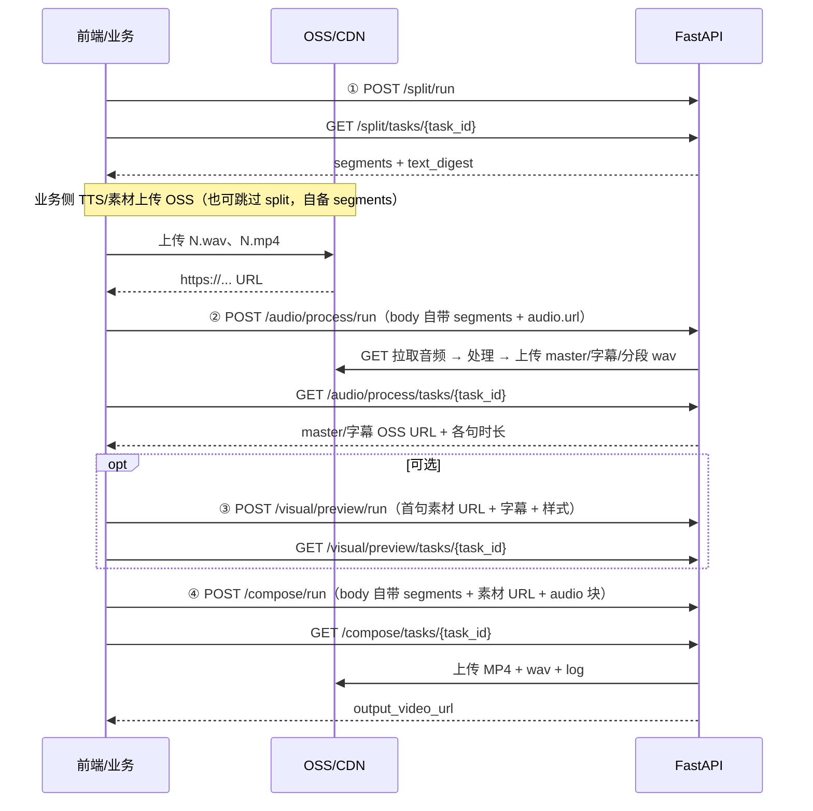

# Flow B FastAPI 服务接口文档

> **版本**：API **v3.1**（四阶段完全独立）  
> **更新**：2026-06-25  
> **Base URL**：`http://<host>:8787`（默认端口 `8787`）  
> **交互式文档**：Swagger [`/docs`](http://127.0.0.1:8787/docs) · ReDoc [`/redoc`](http://127.0.0.1:8787/redoc)  
> **联调脚本**：[`scripts/e2e_noodle_compose_stateless.py`](../scripts/e2e_noodle_compose_stateless.py)

---

## 1. 服务概述

本服务提供 **口播文案 → 分句 → 配音 →（可选）字幕预览 → 视频合成** 的 HTTP API。

### 1.1 v3.1 独立阶段模型

| 概念 | 说明 |
|------|------|
| **四阶段独立** | 分句、配音、预览、合成各自 `POST .../run`，**互不引用上游 task_id** |
| **自包含请求体** | 每步 body 自带 `segments` + 所需 OSS URL；`task_id` 仅用于轮询本步 |
| **无 confirm** | 配音 OSS URL 在 preview/compose 的 `audio` 块中直接传入 |
| **本地临时目录** | 计算过程写入 `JOBS_ROOT/{task_id}/`；完成后归档并删除（`JOB_EPHEMERAL=1`） |
| **OSS 交付物** | 配音/预览/成片等最终产物上传 OSS |
| **异步 Task** | `POST .../run` 返回 `task_id`，轮询 `GET .../tasks/{task_id}` 至 `done` |

**独立 vs 串联**：服务端**不要求**上游 `task_id`。只调其中一个接口、或跳过任意阶段（例如自有分句后直接 `compose/run`）均可。文档中的「联调时可选」仅表示：**若你选择按流水线在 Swagger 里手测**，可把上一步 poll 的 `result` 抄进下一步 body；亦可由业务侧自行准备同等字段，与是否调用过上一接口无关。

### 1.2 核心原则

| 原则 | 说明 |
|------|------|
| **配音不由 API 生成** | 业务侧准备每句 `.wav` 等音频，上传 OSS/CDN 后，将 **HTTPS URL** 传给 `audio/process/run` 的 `segments[].audio.url` |
| **素材不由 API 检索** | 业务侧准备每句画面素材，上传后将 **HTTPS URL** 传给 `compose/run` 的 `segments[].media.url`（compose 内部拉取） |
| **输入：HTTP GET 拉取** | 对请求体中的 URL 执行 GET 下载；**无需**把 OSS AK/SK 交给 API |
| **输出：OSS SDK 上传** | 配音/预览/成片成功后 API 用 `oss2` 上传；须在 `.env` 配置 `ALIYUN_OSS_*` |
| **无 confirm 门禁** | `preview` / `compose` 在 body 的 `audio` 块中直接传 master/字幕 OSS URL，无需 `PUT /audio/confirm` |

### 1.3 可选串联联调示例（非必须）

以下仅为**一种**手测顺序；各步请求体均自包含，不传递上游 `task_id`。



### 1.4 本地临时 vs OSS 交付物

| 阶段 | 本地临时 | OSS 上传 | 需要 `code` + `id` |
|------|----------|----------|-------------------|
| split | JSON 归档 | 无 | 否 |
| audio/process | 处理中暂存 → 上传后删除 | `*_master.wav`、`*_subtitle.srt`、`*_segN.wav` | **是** |
| visual/preview | 预览图临时 | `*_preview_segN.jpg` | **是** |
| compose | 合成临时 → 完成后删除 | `{task_id}.mp4`、`.wav`、`_subtitle.ass`、`.log` | **是** |

OSS 路径前缀：

```
{ALIYUN_OSS_PREFIX}/{code}-{id}/{YYYY-MM-DD}/{task_id}_*
```

> 新创建的 Task ID 为标准 **UUID**（如 `550e8400-e29b-41d4-a716-446655440000`）。非 UUID 格式（含历史 `task_` / `job_` 前缀）一律 **404**。

---

## 2. 通用约定

### 2.1 统一响应格式

**成功**（HTTP 200）：

```json
{
  "code": 0,
  "message": "ok",
  "data": { }
}
```

**失败**（HTTP 4xx/5xx）：

```json
{
  "code": 40401,
  "message": "job not found",
  "data": {
    "request_id": "req_a1b2c3d4e5f6"
  }
}
```

- `code: 0` 表示成功；非 0 为业务错误码
- 每个请求响应头含 `X-Request-Id`；错误 JSON 的 `data.request_id` 与之相同

### 2.2 Task 状态模型

轮询各阶段专用 poll URL，返回：

```json
{
  "code": 0,
  "message": "ok",
  "data": {
    "task_id": "550e8400-e29b-41d4-a716-446655440000",
    "kind": "audio_process",
    "status": "running",
    "progress": {
      "phase": "process",
      "percent": 70,
      "message": "处理配音 12/14（index=12）…"
    },
    "result": null,
    "error": null,
    "created_at": "2026-06-25T09:00:00+00:00",
    "updated_at": "2026-06-25T09:00:30+00:00",
    "queue_position": 2,
    "queue_ahead": 1,
    "queue_message": "前方还有 1 个任务等待执行槽位"
  }
}
```

| `status` | 含义 |
|----------|------|
| `queued` | 已入队，等待执行槽位（可见 `queue_position`） |
| `running` | 执行中（含 `progress.phase` / `percent` / `message`） |
| `done` | 成功；`result` 含本阶段产物 |
| `failed` | 失败；`error` 含结构化错误 |
| `cancelled` | 已取消 |

> **注意**：Task 仅在 **finalize（归档 + OSS 上传）完成后** 才标为 `done`。`running` 且 `progress.message=归档中…` 表示仍在收尾。

### 2.3 轮询 URL

各阶段 poll（`task_id` 须属于对应阶段，否则 404）：

| 阶段 | Poll URL |
|------|----------|
| 分句 | `GET /api/v1/split/tasks/{task_id}` |
| 配音 | `GET /api/v1/audio/process/tasks/{task_id}` |
| 预览 | `GET /api/v1/visual/preview/tasks/{task_id}` |
| 合成 | `GET /api/v1/compose/tasks/{task_id}` |

### 2.4 轮询超时建议

| 阶段 | 建议间隔 | 典型耗时（14 句） |
|------|----------|-------------------|
| split | 2～3 s | 5～30 s |
| audio/process | 3～5 s | 15～60 s |
| visual/preview | 3～5 s | 10～30 s |
| compose | 5～10 s | **~60 s～3 min** |

### 2.5 可选校验字段

以下字段**均为可选**；传入时用于校验请求体内部一致性，**不表示依赖上游 Task**。

| 字段 | 典型来源 | 用途 |
|------|----------|------|
| `text_digest` | 自行计算或 split `result` | 校验 `segments` 文案未漂移；不一致 → **40901** |
| `audio.segments` / `audio.segment_urls` | audio `result` 或业务元数据 | preview/compose 推导各句时长（至少一种） |

---

## 3. 部署与配置

### 3.1 启动

```bash
cd /path/to/videoaudiotext
python3 -m venv .venv && .venv/bin/pip install -r requirements.txt

export JOBS_ROOT="./jobs"
export API_PORT=8787
set -a && source .env && set +a

PYTHONPATH=src .venv/bin/python -m videoaudiotext.api
```

### 3.2 环境变量

| 变量 | 默认 | 说明 |
|------|------|------|
| `API_PORT` | `8787` | 监听端口 |
| `JOBS_ROOT` | `./jobs` | Job 临时目录与 `_job_archive/` 归档根 |
| `JOB_EPHEMERAL` | `1` | `1`=阶段完成后删本地目录；`0`=保留 |
| `GLOBAL_JOB_WORKERS` | `min(4, CPU)` | 全机同时 executing 的 Job 上限 |
| `UVICORN_WORKERS` | `1` | uvicorn 进程数 |
| `OSS_UPLOAD_ENABLED` | `1` | `0` 关闭 OSS 上传 |
| `ALIYUN_OSS_*` | — | endpoint、AK/SK、bucket（输出/upload 必须） |
| `ALIYUN_OSS_PREFIX` | `prod/ImagesVideosText2Video` | OSS object 前缀 |
| `MAINTENANCE_API_TOKEN` | 未设置 | 设置后维护接口须 `X-Maintenance-Token` |
| `API_LOG_LEVEL` | `INFO` | 结构化 JSON 日志级别 |

**LLM 分句**（`split`）：配置 `ARK_API_KEY` + `DOUBAO_MODEL`，或 `LLM_API_KEY` + `LLM_API_BASE` + `LLM_MODEL`。

---

## 4. 接口一览

| 分类 | 方法 | 路径 | 说明 |
|------|------|------|------|
| 系统 | GET | `/api/v1/health` | 健康检查 |
| 系统 | POST | `/api/v1/maintenance/purge-jobs` | TTL 清理过期 Job 目录 |
| 系统 | GET | `/api/v1/maintenance/coord-status` | 全局 Job 协调状态 |
| 分句 | POST | `/api/v1/split/run` | 提交分句 Task |
| 分句 | GET | `/api/v1/split/tasks/{task_id}` | 轮询分句 |
| 配音 | POST | `/api/v1/audio/process/run` | 提交配音 Task |
| 配音 | GET | `/api/v1/audio/process/tasks/{task_id}` | 轮询配音 |
| 预览 | GET | `/api/v1/subtitle/fonts` | 字幕字体列表 |
| 预览 | POST | `/api/v1/visual/preview/run` | 提交预览 Task（可选） |
| 预览 | GET | `/api/v1/visual/preview/tasks/{task_id}` | 轮询预览 |
| 合成 | POST | `/api/v1/compose/run` | 提交合成 Task |
| 合成 | GET | `/api/v1/compose/tasks/{task_id}` | 轮询合成 |
| Task | POST | `/api/v1/tasks/{task_id}/cancel` | 取消 Task |
| 文件 | GET | `/api/v1/tasks/{task_id}/files/{path}` | 下载过程文件（或 302 到 OSS） |

> v2.x 的 `POST /workspaces`、`/workspaces/{id}/...` 路径已移除。

---

## 5. 接口详情

### 5.1 健康检查

**`GET /api/v1/health`**

```json
{
  "code": 0,
  "message": "ok",
  "data": {
    "ok": true,
    "checks": {
      "ffmpeg": { "ok": true },
      "ffprobe": { "ok": true },
      "llm_split": { "ok": true }
    }
  }
}
```

ffmpeg/ffprobe 不可用时返回 HTTP **503**，`code=50301`。

---

### 5.2 分句

#### `POST /api/v1/split/run`

**请求体**

| 字段 | 类型 | 必填 | 说明 |
|------|------|------|------|
| `text` | string | 是 | 口播全文（单行，勿含换行） |
| `include_ai_prompts` | bool | 否 | 是否在 segments 中附带 AI 检索提示词，默认 `false` |
| `global_style` | string | 否 | `电影质感` | `include_ai_prompts=true` 时生效 |

**响应 `data`**

```json
{ "task_id": "550e8400-e29b-41d4-a716-446655440000" }
```

#### 轮询 `result`（`status=done`）

```json
{
  "text_digest": "40d67ef71c5e18648facd82d035d9e56",
  "split_mode_used": "llm",
  "segment_count": 14,
  "segments": [
    {
      "index": 1,
      "text": "夜深之后，城市褪去了白日的喧嚣，",
      "search_query": "",
      "visual": true
    }
  ],
  "warnings": []
}
```

**联调时可选**：从 `result` 复制 `text_digest`、`segments` 到下一步 body；业务侧亦可自行准备同等字段。

---

### 5.3 配音

#### `POST /api/v1/audio/process/run`

**请求体**（自包含，**无** `split_task_id`）

| 字段 | 类型 | 必填 | 说明 |
|------|------|------|------|
| `code` | string | 是 | 租户编码（OSS 路径） |
| `id` | string | 是 | 用户 ID（OSS 路径） |
| `segments` | array | 是 | 每句一条 |
| `segments[].index` | int | 是 | 分句序号（≥1） |
| `segments[].text` | string | 是 | 分句文案 |
| `segments[].audio.url` | string | 是 | 该句原始音频 HTTPS URL |
| `force_refresh` | bool | 否 | 忽略缓存，默认 `false` |
| `speed` | float | 否 | 语速倍率，默认 `1.0` |

**请求示例**

```json
{
  "code": "e2e",
  "id": "noodle-stateless",
  "force_refresh": true,
  "segments": [
    {
      "index": 1,
      "text": "夜深之后，城市褪去了白日的喧嚣，",
      "audio": { "url": "https://bucket.oss-cn-shenzhen.aliyuncs.com/audio/1.wav" }
    }
  ]
}
```

#### 轮询 `result`（`status=done`）

```json
{
  "revision_id": "rev_3d8e475b6392",
  "status": "draft",
  "audio_config_digest": "d46babc765075946865e0e36f6551745",
  "cached": false,
  "segment_count": 14,
  "segments": [
    {
      "index": 1,
      "text": "夜深之后，城市褪去了白日的喧嚣，",
      "duration_sec": 4.005,
      "clip_duration_sec": 4.16,
      "audio_url": "https://bucket.../job_xxx_seg1.wav"
    }
  ],
  "gaps_sec": [0.15, 0.15, 0.35],
  "total_speech_sec": 57.7,
  "total_with_gaps_sec": 60.66,
  "master_audio_url": "https://bucket.../job_xxx_master.wav",
  "subtitle_srt_url": "https://bucket.../job_xxx_subtitle.srt",
  "warnings": []
}
```

> 配音阶段**仅**产出 `master.wav` 与 `subtitle.srt`（时间轴）。ASS 样式层在 `visual/preview` / `compose` 由 SRT 生成，不再上传 `subtitle.ass`。

**联调时可选**：将 master/srt OSS URL、`segment_urls`、`segments`（含 `duration_sec`）填入下游 compose 顶层字段；中间可插 `visual/preview` 调样式。

> `PUT /api/v1/audio/confirm` 已在 v3.1 **移除**（调用返回 404），无需确认步骤。

---

### 5.4 画面预览（可选）

#### `GET /api/v1/subtitle/fonts`

返回字体下拉选项：`{ name, ass_font_name }`。`name` 用于展示并传给 `subtitle_style.font_name`；须在 preview / compose 前调用。

#### `POST /api/v1/visual/preview/run`

传入**首句素材 URL**、**字幕文案**、**分辨率**与**字体样式**，生成单帧预览图（无需完整分句列表或配音 OSS）。

| 字段 | 类型 | 必填 | 说明 |
|------|------|------|------|
| `code` | string | 是 | OSS 路径租户编码 |
| `id` | string | 是 | OSS 路径用户 ID |
| `media_url` | string | 是 | 首句画面素材 HTTPS URL |
| `media_type` | string | 是 | `image` 或 `video` |
| `start_sec` | float | 否 | 视频裁切起点（秒），默认 `0` |
| `text` | string | 是 | 预览字幕文案（单句） |
| `resolution` | object | 是 | 见下表 |
| `subtitle_style` | object | 是 | 见下表 |

**请求示例**

```json
{
  "code": "e2e",
  "id": "preview-user",
  "media_url": "https://bucket.oss-cn-shenzhen.aliyuncs.com/source_media/1.jpg",
  "media_type": "image",
  "text": "夜深之后，城市褪去了白日的喧嚣，",
  "resolution": { "mode": "1080x1920" },
  "subtitle_style": {
    "font_name": "思源黑体",
    "font_scale": 1.2,
    "y_offset": -1
  }
}
```

**`resolution`**

| 字段 | 说明 |
|------|------|
| `mode` | `1080x1920` \| `1920x1080` \| `720x1280` \| `custom` 等 |
| `custom_width` / `custom_height` | `mode=custom` 时必填（偶数） |
| `publish_preset` | `douyin` \| `bilibili` \| `square`（与 mode 二选一） |

**`subtitle_style`**

| 字段 | 说明 |
|------|------|
| `font_name` | 字体名或别名（如「思源黑体」） |
| `font_scale` | 字号倍率，建议 0.5～2.5 |
| `y_offset` | 纵向偏移档位，正数上移 |

#### 轮询 `result`（`status=done`）

```json
{
  "render_style_digest": "a1b2c3...",
  "resolution": { "width": 1080, "height": 1920 },
  "subtitle_style_applied": {
    "font_name": "Source Han Sans SC",
    "font_scale": 1.2,
    "y_offset": -1
  },
  "preview": {
    "text": "夜深之后，城市褪去了白日的喧嚣，",
    "media_type": "image",
    "preview_image_url": "https://bucket.../job_xxx_preview_seg1.jpg"
  },
  "preview_image_url": "https://bucket.../job_xxx_preview_seg1.jpg",
  "preview_object_key": "prod/.../job_xxx_preview_seg1.jpg"
}
```

---

### 5.5 合成

#### `POST /api/v1/compose/run`

**请求体**（自包含；compose 内部拉取每句素材）

| 字段 | 类型 | 必填 | 说明 |
|------|------|------|------|
| `code` | string | 是 | OSS 路径租户编码 |
| `id` | string | 是 | OSS 路径用户 ID |
| `segments` | array | 是 | 分句 + 每句 `media.url` / `media.type` |
| `audio` | object | 是 | 配音 OSS 交付物（须含 `segment_urls` 或 `segments` 时长） |
| `text_digest` | string | 否 | 可选校验 |
| `subtitle_mode` | string | 否 | `hard`（默认）或 `soft` |
| `resolution` | object | 否 | 不传则默认 `1080x1920` |
| `subtitle_style` | object | 否 | 不传则默认字体 |
| `reuse_intermediates` | bool | 否 | 复用中间产物，默认 `true` |
| `cleanup_scratch_on_success` | bool | 否 | 成功后清理 scratch，默认 `true` |

#### 轮询 `result`（`status=done`）

```json
{
  "output_video_url": "https://bucket.../job_bc9a472a1582.mp4",
  "output_video_object_key": "prod/ImagesVideosText2Video/e2e-noodle/2026-06-25/job_bc9a472a1582.mp4",
  "output_audio_url": "https://bucket.../job_bc9a472a1582.wav",
  "output_audio_object_key": "prod/.../job_bc9a472a1582.wav",
  "output_subtitle_ass_url": "https://bucket.../job_bc9a472a1582_subtitle.ass",
  "output_subtitle_ass_object_key": "prod/.../job_bc9a472a1582_subtitle.ass",
  "log_url": "https://bucket.../job_bc9a472a1582.log",
  "log_object_key": "prod/.../job_bc9a472a1582.log",
  "oss_prefix": "prod/ImagesVideosText2Video/e2e-noodle/2026-06-25",
  "intermediates_cleaned": true,
  "job_context_deleted": true
}
```

成片交付以 **`output_video_url`** 为准；最终样式字幕文件使用
**`output_subtitle_ass_url`**。该 ASS 是 compose 根据输入 SRT 与
`subtitle_style` 重新生成的最终版本，与硬字幕/软字幕模式均一致上传。

---

### 5.6 Task 管理

#### `POST /api/v1/tasks/{task_id}/cancel`

取消 `queued` / `running` 状态的 Task。

| HTTP | code | 说明 |
|------|------|------|
| 200 | 0 | 取消成功；已为 `cancelled` 时幂等返回 |
| 404 | 40401 | `task_id` 不存在 |
| 409 | 40904 | 任务已终态（`done` / `failed` / `interrupted`），不可取消 |

---

### 5.8 过程文件下载

**`GET /api/v1/tasks/{task_id}/files/{file_path}`**

允许的路径前缀：

- `deliverables/`、`audio/`、`subtitles/`、`source_media/`、`previews/`、`uploads/`

本地 Job 目录仍存在时返回文件流；已删除时若 OSS 有归档映射则 **302** 重定向到 OSS URL。

> compose 成功后 Job 目录已删，成片请使用 `result.output_video_url`。

---

### 5.9 维护接口

须配置 `MAINTENANCE_API_TOKEN` 时，请求头加：

```
X-Maintenance-Token: <token>
```

#### `POST /api/v1/maintenance/purge-jobs`

按 TTL 扫描 `JOBS_ROOT` 并删除过期目录。默认 `dry_run=true` 仅预览。

| 字段 | 类型 | 默认 | 说明 |
|------|------|------|------|
| `dry_run` | bool | `true` | 仅预览候选 |
| `max_delete` | int | `100` | 单次最多删除数 |
| `include_composed` | bool | `false` | 是否包含已合成目录 |
| `policy` | object | — | 覆盖 TTL 天数 |

#### `GET /api/v1/maintenance/coord-status`

返回 `GLOBAL_JOB_WORKERS`、全局协调文件内容、磁盘 queued/running 统计。

---

## 6. 错误码

### 6.1 HTTP 层（同步请求）

| HTTP | code | 典型 message |
|------|------|--------------|
| 400 | 40001 | 参数缺失/非法 |
| 404 | 40401 | `job not found` / 已废弃路由 |
| 409 | 40901 | digest mismatch（`text_digest` / `audio_config_digest`） |
| 409 | 40902 | 同阶段已有 active Job |
| 500 | 50001 | 内部错误 |
| 502 | 50201 | 输入 URL 拉取失败 |
| 503 | 50301 | `health_check_failed` |

### 6.2 Job 层（轮询 `error` 字段）

```json
{
  "code": 40901,
  "message": "audio_config_digest mismatch",
  "category": "conflict",
  "retryable": false,
  "phase": "fetch",
  "data": {}
}
```

| category | 含义 |
|----------|------|
| `validation` | 参数/状态不合法 |
| `conflict` | digest 或版本冲突 |
| `upstream` | 输入 URL 下载失败 |
| `process` | ffmpeg/合成处理失败 |
| `cancelled` | 用户取消 |

---

## 7. 输入 URL 要求

| 项 | 要求 |
|----|------|
| 协议 | `http://` 或 `https://` |
| 访问 | API 服务器须能匿名 GET 下载 |
| 鉴权 | **不支持**自定义 `Authorization` 头；私有桶请用**预签名 URL** |
| 音频格式 | `.wav` `.mp3` `.m4a` `.aac` `.flac` `.ogg` |
| 视频格式 | `.mp4` `.mov` `.webm` |
| 图片格式 | `.jpg` `.jpeg` `.png` `.webp` |

---

## 8. 完整调用示例（curl）

```bash
BASE=http://127.0.0.1:8787

# 1. 分句（可跳过，自备 segments）
curl -s -X POST "$BASE/api/v1/split/run" \
  -H 'Content-Type: application/json' \
  -d '{"text":"测试第一句。测试第二句。"}'
# 轮询 GET /api/v1/split/tasks/{task_id} 至 done

# 2. 配音（body 自带 segments，无 split_task_id）
curl -s -X POST "$BASE/api/v1/audio/process/run" \
  -H 'Content-Type: application/json' \
  -d '{
    "code": "demo",
    "id": "user-001",
    "label": "v1",
    "segments": [
      {"index":1,"text":"测试第一句。","audio":{"url":"https://example.com/1.wav"}}
    ]
  }'
# 轮询 GET /api/v1/audio/process/tasks/{task_id} → 取 master/字幕 URL 与 segments 时长

# 3. 合成（可直接调用；audio 块填入上一步 result 或业务自备 OSS URL）
curl -s -X POST "$BASE/api/v1/compose/run" \
  -H 'Content-Type: application/json' \
  -d @compose_body.json

# 完整五阶段示例见 scripts/e2e_noodle_compose_stateless.py
```

---

## 9. 联调检查清单

- [ ] `GET /health` 返回 200，`ffmpeg` / `ffprobe` 为 `ok`
- [ ] `.env` 已配置 `ALIYUN_OSS_*`，且 `OSS_UPLOAD_ENABLED=1`
- [ ] 每句 `audio.url` / `media.url` 在服务器侧可 GET
- [ ] `audio/process` 轮询至 `done`（含「归档中」阶段）后，将 OSS URL 填入下游 `audio` 块
- [ ] `bind` / `preview` / `compose` 的 `segments` 条数、文案与 `audio.segments` 一致
- [ ] 可选传入 `text_digest`、`audio_config_digest` 做版本校验
- [ ] compose 完成后使用 `output_video_url`，勿依赖本地 `/files/` 路径

---

## 10. 相关文档

| 文档 | 说明 |
|------|------|
| [api-flow-b-fastapi-walkthrough.md](./api-flow-b-fastapi-walkthrough.md) | 逐步联调指南 |
| [api-flow-b-production.md](./api-flow-b-production.md) | 生产契约与边界情况 |
| Swagger `/docs` | 与代码同步的 OpenAPI 定义（**推荐**作为字段权威来源） |
