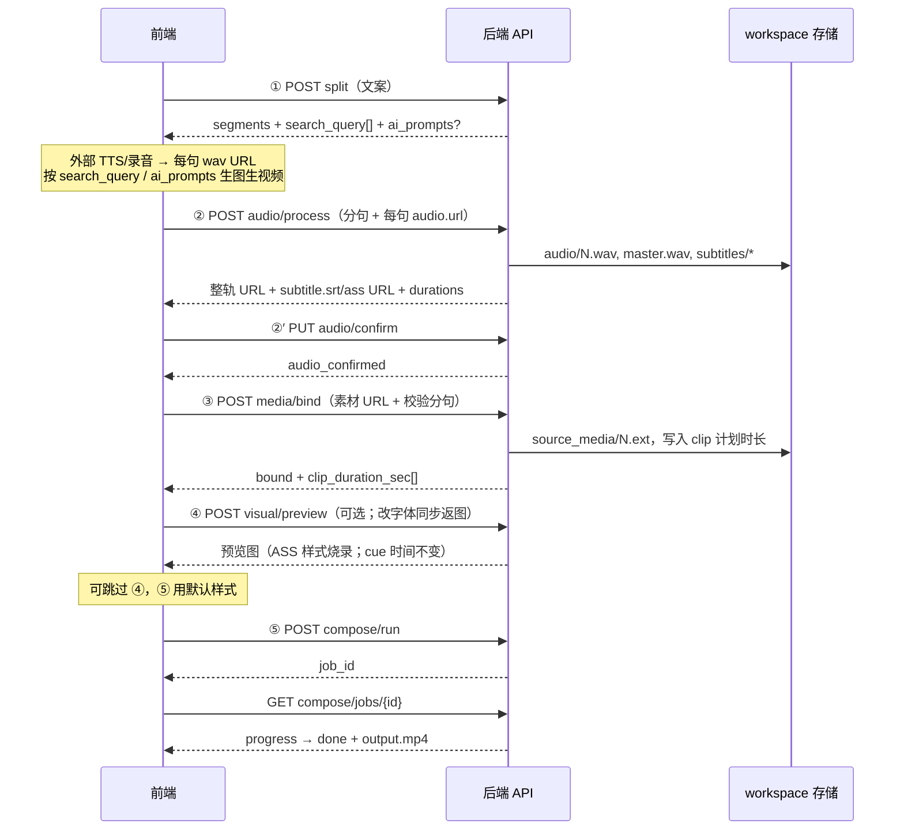
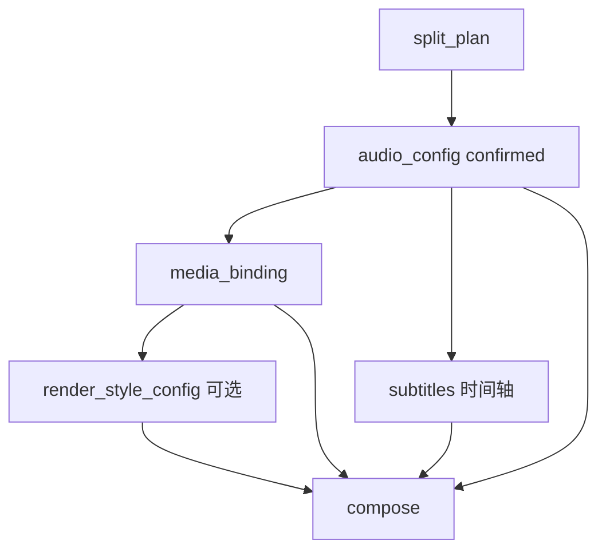
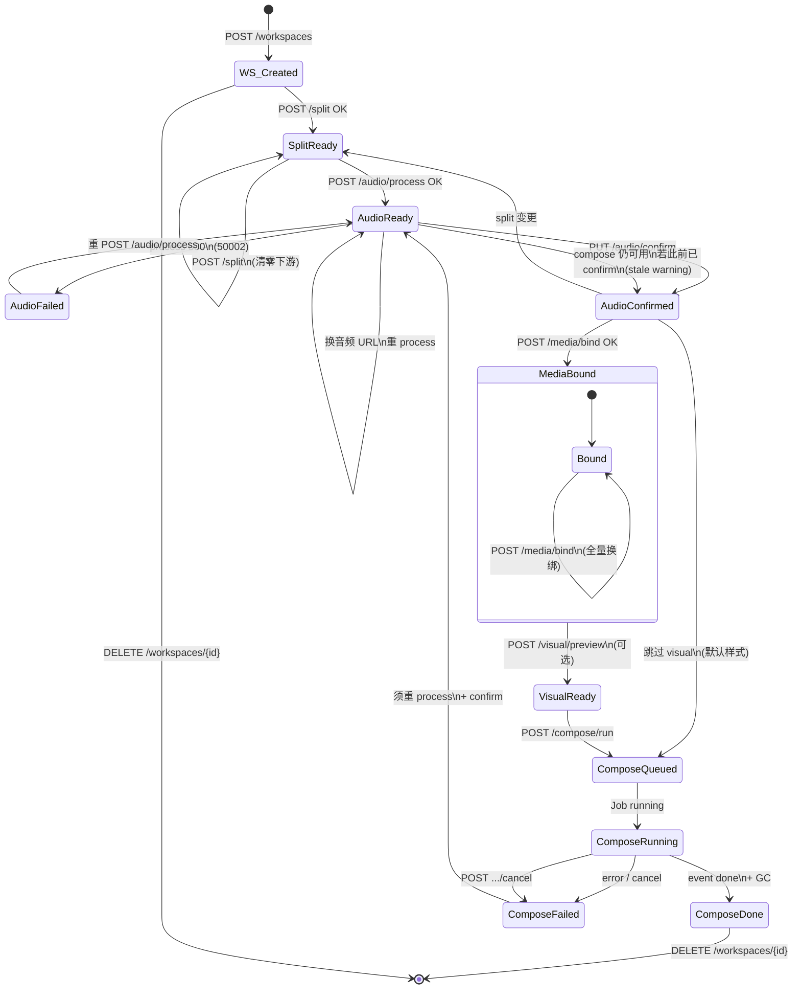

# 流程 B：可干预生产方案（FastAPI 接口设计 · 修订版 v2.30）

> 本文档基于产品侧 **五个主接口** 整理，并对照 `videoaudiotext` 现有代码能力标注「已有 / 需扩展」。  
> **实现状态**：v2.30 已在 `videoaudiotext` 仓库落地；联调以 [walkthrough](./api-flow-b-fastapi-walkthrough.md) 与 [service-api](./api-flow-b-fastapi-service-api.md) 为准。  
> **前端类型**：完整 TypeScript 定义见 [`docs/api-flow-b-types.ts`](./api-flow-b-types.ts)（与本文 JSON 示例同步维护）。  
> **联调 Walkthrough**：见 [`docs/api-flow-b-fastapi-walkthrough.md`](./api-flow-b-fastapi-walkthrough.md)；16 句 JSON 见 [`docs/api-flow-b-web-test-examples.json`](./api-flow-b-web-test-examples.json)。

**v2.30 补充（已实现， supersede v2.24 部分决策）：**

- **全阶段异步 Job**：`POST .../run` + `GET .../jobs/{id}` 轮询。
- **OSS 成片**：`result.output_video_url` 为 OSS HTTPS；须 `ALIYUN_OSS_*` + `oss2`。
- **compose 成功删 workspace**；Job 归档 `_compose_results/`；改稿须新建 workspace。
- **全局并发**：`GLOBAL_JOB_WORKERS` + `_coord/`；排队字段 `queue_position` 等。
- **audio/confirm 可选**：bind 传 `revision_id` 可自动 confirm。

**v2.24 补充（仍有效，除上列 supersede 项）：**

- ② `audio/process` 成功 → **`media_bound` 强制失效**；`segments[].text` **同步回写** `split_plan.json`。
- ⑤ 成片：**音轨/字幕硬切累加**；**画面在 gap 内 xfade 叠化**（与 CLI 一致）。
- ④ 预览：**写回** revision 下 `subtitles/subtitle.ass`；预览帧取该句 **第一条 progressive cue**。
- ~~compose **成功后保留** workspace 中间产物~~ → **v2.30 已改为成功后删除 workspace**（见 §2.7）。

**v2.23 核心变更：**

1. **配音方案 B**：前端按句提交 **音频 URL**（外部录音 / 第三方 TTS），后端拉取、规范化、拼接 `master.wav` 并 **生成字幕时间轴**（SRT + ASS）。
2. **阶段顺序**：**先配音（②）→ 再绑素材（③）**；每段画面时长由 **实测语音 + 段尾 gap** 决定。
3. **字幕分两阶段**：时间轴在 **②** 锁定；**④** 预览 / 成片仅改 **字体、字号、位置** 等样式，不重算 cue 起止。

---

## 目录

1. [需求摘要与流程总览](#1-需求摘要与流程总览)
2. [总体架构](#2-总体架构)
   - [2.4 统一响应与错误码](#24-统一响应与错误码)
   - [2.5 跳过阶段四的默认样式](#25-跳过阶段四的默认样式)
   - [2.6 URL 拉取与 upload 约定](#26-url-拉取与-upload-约定)
   - [2.7 产物目录与清理策略](#27-产物目录与清理策略)
   - [2.8 运行约束、超时与重试](#28-运行约束超时与重试)
3. [阶段一：文案分句 + 检索词 + 提示词](#3-阶段一文案分句--检索词--提示词)
   - [3.2 人工改句](#32-人工改句-put-splitplan)
4. [阶段二：上传逐句音频 → 整轨 + 字幕时间轴](#4-阶段二上传逐句音频--整轨--字幕时间轴)
5. [阶段三：素材 URL 绑定分句（按时长裁切）](#5-阶段三素材-url-绑定分句按时长裁切)
6. [阶段四：字幕样式与画面预览](#6-阶段四字幕样式与画面预览)
7. [阶段五：最终合成](#7-阶段五最终合成)
   - [7.1 成片默认行为（字幕与素材裁切）](#71-成片默认行为字幕与素材裁切)
8. [配置锁定与失效规则](#8-配置锁定与失效规则)
   - [8.2 全局状态机（含失败与重试）](#82-全局状态机含失败与重试)
9. [已确认决策](#9-已确认决策)
10. [与现有代码的映射](#10-与现有代码的映射)
11. [API 清单速查](#11-api-清单速查)
12. [公共与辅助接口详规](#12-公共与辅助接口详规)
    - [12.5 销毁 workspace](#125-delete-apiv1workspacesid--销毁任务)

---

## 1. 需求摘要与流程总览

### 1.1 五个主接口

| # | 接口职责 | 用户操作 | 后端产出 | 变更时 |
|---|----------|----------|----------|--------|
| **①** | 文案分句 | 输入全文（可改句） | 分句 + `search_query` + 可选 `ai_prompts` | 重跑 ① → 下游全失效 |
| **②** | 配音 | 每句提交 **音频 URL**（可改分句文本） | 规范化 `N.wav`、`master.wav`、**`subtitle.srt`（时间轴）** | 换音频 / 改句 → 重跑 ② |
| **③** | 素材绑定 | 每句 **素材 URL** + 沿用 ② 时长 | `source_media/N.ext`、每段 `clip_duration_sec` | 换素材 → 重绑；改 ② → 须重绑 |
| **④** | 字幕样式预览 | 分辨率、字体、偏移（**可选**） | 第 1 句首帧预览图（**仅改 ASS 样式**） | 改样式 → 重预览；可跳过用默认 |
| **⑤** | 合成成片 | 确认生成（须 `code` + `id`） | Job 轮询 → **OSS** `output_video_url` | 成功后 workspace 已删，改稿须新建 workspace |

### 1.2 与旧版 / v2.22 的主要差异

| 项目 | v2.22（后端 TTS） | v2.23（本版） |
|------|-------------------|---------------|
| 配音来源 | 后端 Minimax TTS | 前端 **按句上传音频 URL** |
| 阶段顺序 | 先绑素材 → 再 TTS | **先配音 → 再绑素材** |
| 画面时长 | TTS 时长驱动 | **② 实测语音 + gap** 驱动裁切 |
| 字幕时间轴 | compose 时生成 | **② 生成 SRT**；④ 只改样式 |
| 素材登记 | `upload` + `bind`（file_id） | **③ 一次 bind**（直接 URL） |

### 1.3 流程时序



---

## 2. 总体架构

### 2.1 Base URL 与 workspace

- Base：`/api/v1`
- 每个任务一个 `workspace_id`
- 响应包装：`{ "code", "message", "data" }`
- **鉴权**：**本期不做**（内网/单机假设）；后续可扩展 token 与 workspace 归属校验

### 2.2 workspace 固定目录（已确认）

**根路径（固定）：** `{WORKSPACES_ROOT}/{workspace_id}/`  
实现上 `WORKSPACES_ROOT` 为单一配置项（如 `/data/videoaudiotext/workspaces`），**禁止**将中间文件散落到 workspace 外或随意临时目录（compose  scratch 除外，见下）。

```
{WORKSPACES_ROOT}/{workspace_id}/
├── config/                      # 阶段锁定 JSON（持久，直至 workspace 删除）
│   ├── split_plan.json
│   ├── audio_config.json        # ② 锁定：逐句 URL digest、gap、字幕路径
│   ├── media_binding.json
│   └── render_style_config.json
├── uploads/                     # 【中间】URL 拉取暂存（素材 bind 前可选）
├── source_media/                # 【中间】绑定后 1.jpg / 1.mp4 …
├── audio/                       # 【中间】1.wav … N.wav、master.wav
├── subtitles/                   # 【中间】② 产出；时间轴在 confirm 时锁定
│   ├── subtitle.srt             # cue 起止（④ 不重算）
│   └── subtitle.ass             # 样式层；④ preview 可重生成
├── previews/                    # 【中间】seg_{index}.jpg
├── intermediate/                # 【中间】compose 专用 scratch（固定子路径）
│   └── compose/{job_id}/        # 每 Job 独立；Job 结束一律删除
│       ├── clip/                # 分段渲染
│       ├── staging/             # ffmpeg 临时
│       ├── no_sub.mp4           # 【中间】无字幕视频轨（合成用）
│       ├── cover.jpg            # 【中间】封面帧（可选）
│       ├── subtitle.srt         # 【中间】字幕（合成/调试）
│       └── subtitle.ass         # 【中间】字幕（烧录用）
├── deliverables/                # 【交付】对外长期保留的唯一来源（固定）
│   └── output.mp4               # 硬字幕成片；**唯一**长期交付文件
└── jobs/
    └── compose_{job_id}.json    # Job 状态（queued/running/done/failed）
```

**`GET /files/{path}` 映射：**

| API path 前缀 | 磁盘路径 | 类别 |
|---------------|----------|------|
| `files/deliverables/*` | `deliverables/*` | **仅** `output.mp4`（长期保留至 workspace 删除） |
| `files/audio/*` | `audio/*` | 中间（**compose 成功或失败后均保留**，直至 workspace 删除或上游阶段失效） |
| `files/subtitles/*` | `subtitles/*` | 中间（compose 结束后删除；② 期间可下载校对） |
| `files/source_media/*` | `source_media/*` | 中间 |
| `files/previews/*` | `previews/*` | 中间 |
| `files/uploads/*` | `uploads/*` | 中间 |

> 兼容：实现可保留旧式 `files/output.mp4` → 实际读 `deliverables/output.mp4` 的别名 redirect。

**compose 完成结果 URL** 对外返回 **`result.output_video_url`（OSS HTTPS）**。过程预览仍用 `GET /files/...`（compose 完成前有效）。

> **v2.24 历史**：曾返回 `files/deliverables/output.mp4` 并保留 workspace 支持二次 compose；**v2.30 已变更**。

> **以下均为中间产物**（归类在 `intermediate/compose/{job_id}/`，**禁止**写入 `deliverables/`）：
>
> | 文件 | 说明 |
> |------|------|
> | `no_sub.mp4` | 无字幕视频轨，供烧录字幕前使用 |
> | `cover.jpg` | 封面帧（若流水线导出） |
> | `subtitle.srt` / `subtitle.ass` | 字幕源文件，用于 ASS 烧录 |
>
> Job 结束（成功/失败/取消）后随 scratch **一并删除**；**不**通过 `GET /files` 暴露。

### 2.3 各阶段状态标志

```json
{
  "split_ready": false,
  "audio_ready": false,
  "audio_confirmed": false,
  "media_bound": false,
  "visual_preview_ready": false,
  "compose_ready": false
}
```

| 标志 | 含义 |
|------|------|
| `audio_ready` | 最近一次 `audio/process` 成功；已有逐句 wav、`master.wav`、字幕时间轴 |
| `audio_confirmed` | 用户曾成功 confirm，或 media/bind 自动提升 revision；**compose 前置必须** |
| （digest） | `audio_preview_digest`（最新 process）与 `audio_confirmed_digest`（已锁定）可能不一致；见 §4 |

### 2.4 统一响应与错误码

所有 JSON 接口（`GET /files/*` 除外）使用统一包装：

**成功：**

```json
{
  "code": 0,
  "message": "ok",
  "data": { }
}
```

**失败：**

```json
{
  "code": 40001,
  "message": "segments count mismatch with split_plan",
  "data": {
    "expected_segment_count": 5,
    "received": 4
  }
}
```

| HTTP | 典型 `code` | 场景 |
|------|-------------|------|
| 400 | `400xx` | 参数非法、前置未满足（如未 `audio_confirmed`） |
| 404 | `40401` | `workspace_id` / `job_id` 不存在 |
| 409 | `409xx` | digest 冲突（如 bind 时 `text_digest` 与 plan 不一致） |
| 415 | `41501` | 不支持的媒体类型 |
| 500 | `500xx` | LLM / 音频处理 / ffmpeg 内部错误 |
| 502 | `50201` | 远端 URL 拉取失败（§2.8.4） |
| 503 | `50301` | `/health` 依赖不可用 |
| 504 | `50401` | 上游超时（§2.8.2） |

**建议业务码（节选）：**

| code | 含义 |
|------|------|
| `40001` | bind segments 条数或 index/text 与 split 不一致 |
| `40002` | `audio_not_ready`（无 process 就 confirm） |
| `40003` | `audio_not_confirmed`（未 confirm 就 compose） |
| `40004` | `split_not_ready` / `media_not_bound` 等阶段前置不满足 |
| `40005` | `unknown_subtitle_preset`（请求体含 `subtitle_style.preset`，流程 B 不接受） |
| `40006` | `unknown_publish_preset`（`publish_preset` 非 `douyin` / `bilibili` / `square`） |
| `40007` | `audio_too_short`（规范化后时长 &lt; 0.05s 或损坏） |
| `40901` | `text_digest` 与当前 plan 不一致 |
| `40902` | `compose_job_active`（重复 compose 或 DELETE 时 Job 进行中） |
| `50002` | `audio_process_failed` / `ai_prompt_generation_failed`（ffmpeg 转码、提示词生成等本机处理失败） |
| `50201` | `media_fetch_failed`（音频/素材 URL 拉取重试耗尽） |
| `50003` | `service_interrupted`（进程重启时活跃 Job 被标记） |
| `40903` | `job_cancelled` |
| `40904` | `job_not_cancellable`（终态 Task 不可 cancel） |

### 2.5 跳过阶段四的默认样式

未调用 `visual/preview`、无 `render_style_config.json` 时，阶段五 compose 使用与代码 CLI 一致的默认值（**非** API 请求体字段）：

| 项 | 默认值 | 代码来源 |
|----|--------|----------|
| 分辨率 | **1080×1920**（`mode: 1080x1920`） | `OUTPUT_WIDTH` / `OUTPUT_HEIGHT` |
| 字体 | **思源黑体**（内部 key `siyuanheiti`） | `SUBTITLE_FONT_NAME` |
| 字号倍率 | **1.0** | `font_scale` 默认 |
| 纵向偏移 | **0** | `y_offset` 默认 |
| 字幕策略 | **固定 `llm_rhythm`**（逐行渐进，见 §7.1） | **写死在代码**；**非 API 字段**，不可选 |

### 2.6 URL 拉取与 upload 约定

适用于 **② 逐句音频 URL** 与 **③ 素材 URL** 的后端拉取。

| 项 | 约定 |
|----|------|
| 传输 | 前端传 **公网/内网可访问的 HTTP(S) URL**；后端 `GET` 拉取后落盘 |
| 音频（②） | 拉取后规范化为 `audio/{index}.wav`（见 §4.2） |
| 素材（③） | 拉取后复制为 `source_media/{index}.ext`；可选先暂存 `uploads/` |
| 生命周期 | compose **成功**后 **删除整个 workspace**（OSS 已交付）；**失败/取消**保留 workspace 可重试 compose |
| 大小上限 | **不设 API 硬性单文件上限**；受磁盘与网关/客户端 HTTP 超时约束 |
| 素材扩展名 | 图片 `.jpg` `.jpeg` `.png` `.webp`；视频 `.mp4` `.mov` `.webm` |
| 音频扩展名 | **`.wav` `.mp3` `.m4a` `.aac` `.flac` `.ogg`**（与 `audio/bgm.py` 一致） |
| type 校验 | `media/bind` 时若 `type` 与推断类型不一致 → **400** |

### 2.7 产物目录与清理策略（v2.30 已实现）

#### 分类

| 类别 | 目录 | compose 成功后 | compose 失败后 |
|------|------|----------------|----------------|
| **整个 workspace** | `{workspace_id}/` | **整目录删除**（OSS 上传成功后） | **保留**（可重试 compose） |
| **Job 归档** | `workspaces/_compose_results/{job_id}.json` | **保留**（含 OSS URL） | 失败时 Job 仍在 workspace 或归档 |
| **Job scratch** | `intermediate/compose/{job_id}/` | 删除（上传前/后 finalize） | **自动删除** |
| **失败半成品** | `deliverables/output.mp4` | — | 删除本次不完整 mp4 |

#### compose 成功：`status: done` 之后（v2.30）

1. 上传 OSS：`{ALIYUN_OSS_PREFIX}/{code}-{id}/{date}/{job_id}.mp4`（及 `.wav`、`.log`）
2. **`store.delete_tree()`** — 删除整个 workspace
3. **`archive_compose_job(job)`** — Job JSON 写入 `_compose_results/`
4. `result.workspace_deleted: true`；`GET .../status` 与 `GET .../files/*` 对该 workspace 返回 **404**
5. 仍可用原 URL `GET .../compose/jobs/{job_id}` 轮询（读归档）

`result.intermediates_cleaned` 表示 compose scratch 已删（上传前步骤），**不**表示 workspace 仍存在。

#### compose 失败 / 取消：`status: failed|cancelled`

Job 的 **`finally` 块必须执行清理**（避免磁盘占满）：

1. **删除** `intermediate/compose/{job_id}/`（含 `no_sub.mp4`、`cover.jpg`、`subtitle.srt`、`subtitle.ass`、clip、staging 等）
2. **删除** 本 Job 写入的 **不完整** `deliverables/output.mp4`（对比 Job 开始前的文件 mtime；**不删**上次成功合成的成片）
3. **保留** `audio/`、`subtitles/`、`source_media/`、`previews/`、`uploads/`、`config/`
4. **状态**：`audio_ready` / `audio_confirmed` **保持不变**（可直接再次 `compose/run`；若音频已变须自行重跑 `audio/process`）

Job `error` 为结构化错误（数字 `code`、`category`、`retryable`、`data.cleaned_paths`）。

#### 实现要点

- compose 流水线写盘：**中间文件**（无字幕轨、封面、字幕源）**只许**落在 `intermediate/compose/{job_id}/`；**唯一交付** `deliverables/output.mp4` 在烧录完成后写入。禁止 `/tmp` 散落（或 `/tmp` 仅作 stream buffer，不落最终文件）
- GC 函数：`cleanup_compose_job(job_id, *, success: bool)`，由 Job runner 在 success/failure 两路径调用
- 日志：`[workspace-gc] job={job_id} success={bool} removed=[…]`

---

### 2.8 运行约束、超时与重试

本节约定 **网关/前端 HTTP 超时建议**、**服务端实现参考配置**（非 API 请求字段）、以及 **谁负责重试**。与 [§2.6](#26-url-拉取与-upload-约定)、`§2.4` 错误码配合使用。

#### 2.8.1 体积与 Job 形态（v2.30）

| 项 | 约定 |
|----|------|
| 单素材大小 | **不设 API 硬性上限**（§2.6） |
| 长任务 | **split / audio / media / preview / compose** 均为异步 Job + 轮询 |
| 全局并发 | `GLOBAL_JOB_WORKERS` 限制全机 executing 数；超出则 `queued` + 排队字段 |
| 成片交付 | `result.output_video_url`（OSS HTTPS）；**非** `GET /files/deliverables/output.mp4` |

#### 2.8.2 推荐 HTTP 超时（客户端 / 反向代理）

实现 MUST 在超时前返回 JSON 错误（**504** 或 **500**），避免连接无声挂断。下表为 **建议下限**（秒）：

| 接口 | 建议 timeout | 依据 |
|------|--------------|------|
| `POST /split` | **90**；`include_ai_prompts=true` 时 **120** | LLM 分句 + 可选 batch prompts |
| `POST /media/bind` | **`max(180, segment_count × 120)`** | 多段 OSS 视频/图片 URL 拉取 + 落盘（原 30s 易超时） |
| `POST /audio/process` | **`max(180, segment_count × 90)`** | 多段 URL 拉取 + ffmpeg 转码 + 字幕（原 `max(120, n×60)`） |
| `POST /visual/preview` | **120** | ffmpeg 裁切 + ASS 烧录一帧 |
| `POST /compose/run` | **15** | 仅入队 |
| `GET /compose/jobs/{id}` | **15** | 轮询 |
| `DELETE /workspaces/{id}` | **60** | 递归删目录 |

#### 2.8.3 服务端环境变量（实现参考）

非 API 字段；部署时在 `.env` 配置，**health** 可暴露只读摘要：

| 变量 | 默认 | 作用 |
|------|------|------|
| `GLOBAL_JOB_WORKERS` | `min(4, CPU)` | 全机同时 executing 的 Job 上限 |
| `UVICORN_WORKERS` | `1` | uvicorn 进程数；>1 时用 `_coord/` 文件锁 |
| `CLIP_BUILD_WORKERS` | `min(4, CPU)` | CLIP/ffmpeg 并行线程上限 |
| `OSS_UPLOAD_ENABLED` | `1` | 关闭则 compose 不上传 OSS |
| `ALIYUN_OSS_*` | — | compose 成片上传（须 `oss2`） |
| `LLM_TIMEOUT_SEC` | `60` | 分句 LLM 读超时 |
| `AUDIO_UPLOAD_FETCH_TIMEOUT_SEC` | **`0`（不限）** | ②/③ 拉取远端音频/素材 URL 的读超时 |
| `AUDIO_UPLOAD_MAX_RETRIES` | `3` | 音频 URL 拉取可重试次数 |
| `MEDIA_UPLOAD_FETCH_TIMEOUT_SEC` | **`0`（不限）** | 素材 URL 拉取读超时 |
| `MEDIA_UPLOAD_MAX_RETRIES` | `3` | 素材 URL 拉取可重试次数 |

**音频规范化（服务端内部，对齐 `tts/audio.py` / `tts/minimax.py`）：**

- 任意合法输入经 ffmpeg 转为 **`pcm_s16le` WAV**，落盘 `audio/{index}.wav`
- 采样率 **44100 Hz**、**单声道**（`aresample=44100`，`ac=1`）；与 `build_master_audio` / `concat_wav_files` 一致
- 时长一律 **`ffprobe` 实测**（`measure_wav_durations` / `get_audio_duration_seconds`），**不用**文案估时驱动时间轴

**段尾 gap（对齐 `audio/gaps.py`）：**

- 由 **分句文本标点** 计算（`compute_sentence_gaps`），与音频内容无关
- 大句末（`。！？` 等）：默认 **0.35s**（`GAP_BIG_SENTENCE_SEC`）
- 小句末（`，、；` 等）：默认 **0.15s**（`GAP_SMALL_SENTENCE_SEC`）
- **末段 gap = 0**；`GAP_ENABLED=0` 时全部为 0

~~TTS 限流~~：本期无后端 TTS。

#### 2.8.4 重试策略（服务端 vs 前端）

| 场景 | 服务端 | 前端 |
|------|--------|------|
| **音频单段拉取/转码失败** | 连接失败 / 5xx / 429：单段最多 **3 次**退避重试 | 拉取耗尽 → **502**（`50201`）；转码失败 → **500**（`50002`） |
| **`audio/process` 整单失败** | 不残留半成品 wav/字幕 | `audio_ready` 保持 false |
| **素材 / 音频 URL 拉取** | 同 §2.8.4 原 media 规则（SSRF、流式、不限读超时） | 网关 **504** / **50201** 时调大代理 timeout |
| **`split` / LLM 失败** | 一般不自动重试 | 用户触发重试或改文案 |
| **compose Job 失败** | `finally` GC（§2.7）；**保留**已确认音频 | 可直接 `compose/run` 重试 |
| **compose Job 取消** | 同失败路径清理 scratch + 不完整 mp4 | `POST .../jobs/{id}/cancel`（§7）；**不删** `audio/` |

**URL 拉取安全（SSRF，已确认实现要求）：**

- 仅允许 **http/https**；禁止 `file://`、内网/metadata IP（10/8、172.16/12、192.168/16、127.0.0.0/8、169.254/16、::1 等）。
- 拉取时使用 **有限次重定向**（建议 ≤ 3）；最终 URL 仍须通过 SSRF 校验。
- **流式下载**至落盘，**不设单文件大小上限**、**不设服务端读超时**；仅受磁盘、对端断开及 **网关/客户端** 对同步 POST 请求的整体超时约束。

#### 2.8.5 补充业务错误码

| HTTP | code | 含义 |
|------|------|------|
| 502 | `50201` | `media_fetch_failed`（URL 拉取重试耗尽或不可达） |
| 500 | `50002` | `audio_process_failed`（任一段音频失败） |
| 504 | `50401` | `upstream_timeout`（多为网关/代理切断长请求；LLM 读超时） |
| 409 | `40902` | `compose_job_active`（DELETE workspace 或重复 compose 时 Job 进行中） |

---

## 3. 阶段一：文案分句 + 检索词 + 提示词

### 3.1 ① 分句并返回检索词

**`POST /api/v1/workspaces/{id}/split`**

#### 传入

```json
{
  "text": "今天我们来聊聊古城的黄昏。站在城墙上，看夕阳把砖瓦染成金色。",
  "include_ai_prompts": true,
  "global_style": "电影质感"
}
```

| 字段 | 必填 | 说明 |
|------|------|------|
| `text` | 是 | 口播全文 |
| `include_ai_prompts` | 否 | 默认 **`false`**；为 **`true`** 时才调用 `generate_batch_prompts` 生成生图/生视频提示词（额外 LLM 耗时） |
| `global_style` | 否 | 仅 `include_ai_prompts=true` 时生效；默认 `"电影质感"` |

> **已确认**：流程 B **固定 LLM 分句**；每段**必有** `search_query`。`ai_prompts` / `ai_prompts_global` **可选**，由 `include_ai_prompts: true` 触发。

> **说明**：分句 plan **不绑定** voice/rate（已确认：改音色/语速不回阶段一）。`split_plan.json` 仅存 `text_digest` + segments，不含 `voice_digest`。

> **video 提示词与时长估计**：`include_ai_prompts=true` 时，video prompt 用 `estimate_duration(text)` 默认 **4.5 字/秒** 估算（**仅喂 LLM**，与 ② 实测 `duration_sec`、合成时间轴无关）。

#### 返回

**当 `include_ai_prompts: true`：**

```json
{
  "text_digest": "md5…",
  "split_mode_used": "llm",
  "segment_count": 2,
  "segments": [
    {
      "index": 1,
      "text": "今天我们来聊聊古城的黄昏。",
      "search_query": "古城 黄昏 城墙",
      "visual": true,
      "ai_prompts": {
        "image": {
          "positive_prompt": "古城墙垣，黄昏暖光，砖瓦金色，9:16竖屏，电影质感，…",
          "negative_prompt": "低质量，模糊，水印，…"
        },
        "video": {
          "positive_prompt": "缓慢推镜，古城黄昏，城墙剪影，暖色调，…",
          "negative_prompt": ""
        }
      }
    },
    {
      "index": 2,
      "text": "站在城墙上，看夕阳把砖瓦染成金色。",
      "search_query": "城墙 夕阳 砖瓦",
      "visual": true,
      "ai_prompts": {
        "image": {
          "positive_prompt": "…",
          "negative_prompt": "…"
        },
        "video": {
          "positive_prompt": "…",
          "negative_prompt": ""
        }
      }
    }
  ],
  "ai_prompts_global": {
    "video_global_negative_prompt": "…",
    "video_film_look": "35mm film grain, soft contrast, …"
  },
  "warnings": []
}
```

**当 `include_ai_prompts: false`（默认）：** 结构相同，但各段**不含** `ai_prompts` 字段，且无 `ai_prompts_global`：

```json
{
  "text_digest": "md5…",
  "split_mode_used": "llm",
  "segment_count": 2,
  "segments": [
    {
      "index": 1,
      "text": "今天我们来聊聊古城的黄昏。",
      "search_query": "古城 黄昏 城墙",
      "visual": true
    }
  ],
  "warnings": []
}
```

| 返回字段 | 说明 |
|----------|------|
| `segments[].search_query` | 检索锚点词（2–5 个中文关键词）；**始终返回** |
| `segments[].ai_prompts` | 仅 `include_ai_prompts=true` 时存在；含 `image` / `video` 正向/反向 prompt |
| `ai_prompts_global` | 仅 `include_ai_prompts=true` 时存在；含 `video_global_negative_prompt`、`video_film_look` |
| `segments[].visual` | 恒为 `true` |

**副作用：** 写 `split_plan.json`，置 `split_ready=true`；并使 `audio_ready`、`audio_confirmed`、`media_bound`、`visual_preview_ready`、`compose_ready` **失效**（须按 §8 重跑后续阶段）。

---

## 4. 阶段二：上传逐句音频 → 整轨 + 字幕时间轴

**`POST /api/v1/workspaces/{id}/audio/process`**

**前置**：`split_ready == true`

> **配音方案 B（已确认）**：前端为每句提供 **可访问的音频 URL**（外部录音、第三方 TTS 等）；**后端不调用 Minimax TTS**。后端负责：拉取 → 规范化 WAV → 测时长 → 算 gap → 拼 `master.wav` → **生成字幕时间轴**（SRT + ASS）。

### 4.1 传入

```json
{
  "text_digest": "md5…",
  "segments": [
    {
      "index": 1,
      "text": "今天我们来聊聊古城的黄昏。",
      "audio": {
        "url": "https://cdn.example.com/voice/seg1.wav"
      }
    },
    {
      "index": 2,
      "text": "站在城墙上，看夕阳把砖瓦染成金色。",
      "audio": {
        "url": "https://cdn.example.com/voice/seg2.mp3"
      }
    }
  ],
  "force_refresh": false
}
```

| 字段 | 必填 | 说明 |
|------|------|------|
| `text_digest` | 建议 | 与 `split` 返回一致；不一致 → **409** |
| `segments` | 是 | 条数、各 `index` 须与 `split_plan` 一致；`text` 可与当前 plan **不同**——成功后 **回写** `split_plan.json` 各段 `text` 并重算 `text_digest`（**不**自动重算 `search_query` / `ai_prompts`） |
| `segments[].audio.url` | 是 | 该句音频 HTTP(S) URL |
| `force_refresh` | 否 | `true` 时忽略缓存，强制重拉重算 |

**校验：**

- `segments` 条数与 `split_plan.segment_count` 不一致 → **400**（`40001`）
- 任一段 `audio.url` 拉取/转码失败（重试耗尽）→ **500**（`50002`），**不**写入半成品
- 规范化后时长 **< 0.05s** 或文件损坏 → **400**（`40007` `audio_too_short`）
- 时长与文本「字数估时」差异 **不拒收**；以 **ffprobe 实测** 为时间轴唯一依据（与 CLI 一致）

### 4.2 音频规范化（实现对齐现有代码）

| 项 | 约定 |
|----|------|
| 输入格式 | `.wav` `.mp3` `.m4a` `.aac` `.flac` `.ogg` |
| 落盘格式 | `pcm_s16le` WAV → `audio/{index}.wav` |
| 采样率 / 声道 | **44100 Hz，单声道**（ffmpeg `aresample` + `ac=1`） |
| 时长 | `get_audio_duration_seconds` / `measure_wav_durations`（ffprobe） |
| 整轨 | `build_master_audio`：各句 WAV + `gaps_sec` 尾静音 → `audio/master.wav`（硬切，无 BGM） |
| Gap | `compute_sentence_gaps(texts)`：大句末 0.35s / 小句末 0.15s / 末段 0（§2.8.3） |

### 4.3 字幕时间轴（本阶段锁定）

在 **无素材** 条件下调用 `build_subtitles`（`subtitle/export.py`），写入：

- `subtitles/subtitle.srt` — cue 起止时间（**④ 不重算**）
- `subtitles/subtitle.ass` — 默认样式 ASS（④ 可仅重生成样式层）

| 项 | 行为（对齐现有流水线） |
|----|------------------------|
| 策略 | 固定 **`llm_rhythm` 逐行渐进**（`expand_wrap_reveal_cues`） |
| 时间轴 | 各段 `speech_duration` = 实测 wav 时长；绝对时间 = 累加 + gap |
| 音频微调 | 可选 `refine_progressive_cues_from_audio`（段内 cue 对齐波形） |
| ASR 对齐 | 环境变量 `SUBTITLE_ASR_ALIGN=1` 时 `align_cues_with_audio`（Whisper） |
| 质量警告 | 非阻塞 `warnings[]`（如 cue 过短、重叠等，`collect_cue_quality_warnings`） |

> **④ 预览 / ⑤ 合成** 只读取 **SRT 时间轴** + 更新 ASS **字体/字号/位置**；改样式 **不改变** cue 起止。

### 4.4 返回

```json
{
  "audio_config_digest": "…",
  "cached": false,
  "segment_count": 2,
  "segments": [
    {
      "index": 1,
      "text": "今天我们来聊聊古城的黄昏。",
      "duration_sec": 3.21,
      "audio_url": "/api/v1/workspaces/{id}/files/audio/1.wav",
      "clip_duration_sec": 3.56
    },
    {
      "index": 2,
      "text": "站在城墙上，看夕阳把砖瓦染成金色。",
      "duration_sec": 2.85,
      "audio_url": "/api/v1/workspaces/{id}/files/audio/2.wav",
      "clip_duration_sec": 2.85
    }
  ],
  "gaps_sec": [0.35, 0.0],
  "total_speech_sec": 6.06,
  "total_with_gaps_sec": 6.41,
  "master_audio_url": "/api/v1/workspaces/{id}/files/audio/master.wav",
  "subtitle_srt_url": "/api/v1/workspaces/{id}/files/subtitles/subtitle.srt",
  "subtitle_ass_url": "/api/v1/workspaces/{id}/files/subtitles/subtitle.ass",
  "warnings": []
}
```

| 返回字段 | 说明 |
|----------|------|
| `segments[].duration_sec` | 该句 **纯人声**时长（ffprobe） |
| `segments[].clip_duration_sec` | **画面计划时长** = `duration_sec` + 该段 `gaps_sec[i]`（供 ③ 裁素材） |
| `master_audio_url` | 人声 + 全部 gap 的整轨 WAV |
| `subtitle_*_url` | 时间轴字幕；compose 前可下载校对 |
| `warnings` | 字幕质量等非阻塞提示 |

### 4.5 变更与锁定

- 换任一句 `audio.url` 或改 `segments[].text` → 重新 `POST /audio/process/run`（异步 Job + 轮询）
- **`audio/process` 成功副作用（已确认）**：
  - 将请求中各段 `text` **同步写入** `split_plan.json`（及 `text_digest`）；`search_query` 不自动更新
  - 置 `audio_ready=true`；**强制** `media_bound=false`、`visual_preview_ready=false`、`compose_ready=false`（`clip_duration_sec` 可能变化，**须重新** `media/bind`）
- **`PUT /audio/confirm`（可选）**：bind 传 `revision_id` 可自动 confirm；compose 须 `audio_confirmed=true`
- **process 与 confirm 双 digest**（同 v2.22 TTS 规则）：
  - 从未 confirm → `audio_confirmed=false`，compose **400**
  - 已 confirm 后又 process 新音频未再 confirm → `audio_confirmed` **保持 true**；compose **仍用** confirmed；`GET /status` 返回 `audio_preview_stale: true`
  - 再次 `PUT /audio/confirm` → 覆盖 confirmed 配置
- **改文案 / 改句（split 变更）** → `audio_ready`、`audio_confirmed`、`media_bound` **均清零**

**`PUT /api/v1/workspaces/{id}/audio/confirm`**

**前置**：`audio_ready == true`

无请求体。返回：

```json
{
  "audio_confirmed": true,
  "audio_config_digest": "…",
  "audio_preview_digest": "…"
}
```

**BGM**：本期不在阶段二提供；阶段五混音也**暂不实现**。

---

## 5. 阶段三：素材 URL 绑定分句（按时长裁切）

**`POST /api/v1/workspaces/{id}/media/bind`**

**前置**：`audio_confirmed == true`（须先锁定 ② 时间轴与时长）

> 无独立 `media/upload`：本接口 **直接收素材 URL**，后端拉取并绑定到 `source_media/{index}.ext`。每段 **裁切/循环时长** 取自 `audio_config` 的 `clip_duration_sec`。

### 5.1 传入

```json
{
  "text_digest": "md5…",
  "audio_config_digest": "md5…",
  "segments": [
    {
      "index": 1,
      "text": "今天我们来聊聊古城的黄昏。",
      "media": {
        "url": "https://cdn.example.com/clips/gucheng_clip.mp4",
        "type": "video",
        "start_sec": 2.5
      }
    },
    {
      "index": 2,
      "text": "站在城墙上，看夕阳把砖瓦染成金色。",
      "media": {
        "url": "https://cdn.example.com/images/sunset.jpg",
        "type": "image"
      }
    }
  ]
}
```

| 字段 | 必填 | 说明 |
|------|------|------|
| `text_digest` | 建议 | 与 split 一致 |
| `audio_config_digest` | 建议 | 与 **confirmed** 音频配置一致；不一致 → **409** |
| `segments[].text` | 是 | 须与 split / audio 配置一致 |
| `media.url` | 是 | 图片或视频 URL |
| `media.type` | 是 | `image` / `video` |
| `media.start_sec` | 否 | 视频入点；**默认 `0`** |

**校验**：`segments` 条数与 plan 一致；各 `index` / `text` 匹配；否则 **400**。

**换素材**：无单句 PATCH；须 **全量 POST** `media/bind`。

### 5.2 时长与裁切规则

| 项 | 规则 |
|----|------|
| 每段目标时长 | `clip_duration_sec` = ② 返回的 `duration_sec + gaps_sec[i]` |
| 图片 | 静图展示 **整段 `clip_duration_sec`** |
| 视频长于目标 | 从 `start_sec` 裁切至目标时长 |
| 视频短于目标 | **`stream_loop` 循环**填满（§7.1）；不用尾帧定格 |
| 入点继承 | 可选 `apply_sequential_inherit_offsets`（与 CLI 一致） |

### 5.3 返回

```json
{
  "bound": true,
  "segment_count": 2,
  "segments": [
    {
      "index": 1,
      "text": "今天我们来聊聊古城的黄昏。",
      "search_query": "古城 黄昏 城墙",
      "duration_sec": 3.21,
      "clip_duration_sec": 3.56,
      "media": {
        "source_url": "https://cdn.example.com/clips/gucheng_clip.mp4",
        "type": "video",
        "local_path": "source_media/1.mp4",
        "file_url": "/api/v1/workspaces/{id}/files/source_media/1.mp4",
        "start_sec": 2.5
      }
    }
  ],
  "media_binding_digest": "…"
}
```

**副作用**：写 `media_binding.json`，置 `media_bound=true`；并使 `visual_preview_ready`、`compose_ready` 失效。

---

## 6. 阶段四：字幕样式与画面预览

**`POST /api/v1/workspaces/{id}/visual/preview`**

**前置**：`media_bound == true` 且 `audio_confirmed == true`

### 已确认的产品行为

- **默认只预览第 1 句、第 1 帧画面**：`preview_segment_index` 默认 `1`
- **预览字幕内容（已确认）**：烧录该句在 `subtitle.srt` 中 **第一条 progressive cue** 的文本与样式（该句内多条 cue 时，**不**取中间时刻）
- **字幕时间轴不变**：cue 起止仍来自 ② `subtitle.srt`；按请求参数 **重生成并写回** `subtitles/subtitle.ass`（**非**仅 scratch 临时文件），供 ⑤ compose 烧录
- **样式变更实时返图**：改 `font_scale` / `font_name` / `resolution` 后 **再次 POST**，立即返回新 `preview_image_url`
- **必须带字幕烧录**：与成片同源 ASS 烧录逻辑（`export_preview_cover_frame`）

### 传入

```json
{
  "resolution": {
    "mode": "1080x1920",
    "custom_width": null,
    "custom_height": null
  },
  "subtitle_style": {
    "font_name": "思源黑体",
    "font_scale": 1.0,
    "y_offset": 0
  },
  "preview_segment_index": 1
}
```

| 字段 | 必填 | 说明 |
|------|------|------|
| `preview_segment_index` | 否 | 1-based，**默认 `1`**（第一句 + 绑定素材首帧）；一般无需改 |
| `resolution.*` | 是 | 输出画布；见下表 |
| `subtitle_style.font_name` | 是 | 字体名称（如 `思源黑体`） |
| `subtitle_style.font_scale` | 是 | 字号倍率（相对画布默认字号，如 `1.0`） |
| `subtitle_style.y_offset` | 否 | 字幕纵向偏移（像素或实现约定单位），**默认 `0`** |

> **字幕策略（已确认）**：流程 B **固定** `llm_rhythm`（逐行渐进，§7.1）。**请求体不含** `subtitle_style.preset`。

**`resolution.mode` 枚举：** `1080x1920` | `720x1280` | `2160x3840` | `1920x1080` | `1280x720` | `1080x1080` | `source` | `source_largest` | `custom`（`custom` 时须传 `custom_width` / `custom_height`，偶数，64–7680）

**`publish_preset`（可选）：** 与 `mode` **二选一**即可；若同时传入且冲突 → **`mode` 优先**。

| 值 | 说明 | 等价 `mode` |
|----|------|-------------|
| `douyin` | 抖音 / 视频号竖屏 | `1080x1920` |
| `bilibili` | B 站横屏 | `1920x1080` |
| `square` | 方屏（1:1） | `1080x1080` |

其它值（如 `xiaohongshu`、`youtube_shorts`）→ **400**（`40006` `unknown_publish_preset`）。其它画幅请直接用 `resolution.mode`（如 `720x1280`、`custom`）。

预览图 = 该句素材裁切至目标分辨率 + **硬字幕烧录一帧**（该句 **首条 progressive cue** + 当前样式）。  
成片为逐行渐进多条 cue；**不能**从静态图看出切换节奏，须以 **成片 `output.mp4`** 为准。

### 返回

```json
{
  "render_style_digest": "…",
  "resolution": { "width": 1080, "height": 1920 },
  "subtitle_style_applied": {
    "font_name": "思源黑体",
    "font_size_px": 72,
    "font_scale": 1.0,
    "y_offset": 0
  },
  "preview": {
    "segment_index": 1,
    "text": "今天我们来聊聊古城的黄昏。",
    "media_type": "video",
    "preview_image_url": "/api/v1/workspaces/{id}/files/previews/seg_1.jpg"
  }
}
```

> 返回字段由数组 `previews[]` 改为单个 `preview` 对象，因每次只出一图。

### 变更与锁定

- 改分辨率 / 字体 / `font_scale` / `y_offset` → 对当前句重新 `POST /visual/preview`
- 换预览句 → 同 API，改 `preview_segment_index`（样式参数可不变）
- 素材绑定变更 → 相关句须重新预览
- 每次 `visual/preview` 成功 → 更新 `render_style_config.json`、**写回** `subtitles/subtitle.ass`，并置 `visual_preview_ready=true`
- compose：存在 `render_style_config.json` 则采用其中样式；**未跑阶段四** 则走代码默认（§7）
- **② 换音频 / 改句** → 字幕时间轴已在 ② 更新；④ 仅须重 preview 样式（若已跑过 ④）

**说明**：阶段四整体**可选**——可跳过，阶段五用默认样式合成（§2.5、§7）。

---

## 7. 阶段五：最终合成

**`POST /api/v1/workspaces/{id}/compose/run`**（**异步 Job**，已确认）

### 前置

- **必须**：`split_ready && audio_confirmed && media_bound`
- **可选**：`visual_preview_ready`——未跑阶段四时，使用 [§2.5 默认样式](#25-跳过阶段四的默认样式)
- digest 校验：`split_plan`、`media_binding`、**`audio_confirmed_digest`** 须一致；若存在 `render_style_config` 则一并校验

### 传入

通常只传 `workspace_id`；可选：

```json
{
  "subtitle_mode": "hard",
  "reuse_intermediates": true,
  "cleanup_scratch_on_success": true
}
```

| 字段 | 说明 |
|------|------|
| `subtitle_mode` | `hard` / `soft`；成片用 |
| `reuse_intermediates` | 复用已生成 clip（同 workspace 内重试 compose 时） |
| `cleanup_scratch_on_success` | 默认 **`true`**：删 compose scratch；**v2.30** 成功后整个 workspace 亦删除 |
| `code` / `id` | **必填**；OSS 路径 `prod/ImagesVideosText2Video/{code}-{id}/{date}/{job_id}.*` |

> **v2.30**：compose 成功上传 OSS 后 **删除整个 workspace**，不支持同 workspace 二次 compose。

**本期不包含**：BGM、`voice_volume` 等混音参数。

**Job 生命周期与清理（已确认）：**

| 时机 | 行为 |
|------|------|
| Job `running` | scratch 写入 `intermediate/compose/{job_id}/`；成片写入 `deliverables/output.mp4` |
| Job `done` | 上传 OSS → **删除整个 workspace** → 归档 Job 至 `_compose_results/` |
| Job `failed` / `cancelled` | **`finally`** 清理 scratch + 本 Job 不完整 `deliverables/output.mp4`；**保留** `audio/`、`subtitles/` |
| 重试 | 失败后可直接 `compose/run`；音频变更后须 `audio/process` + `audio/confirm` |

### 异步 Job 与轮询（v2.30）

**适用范围**：split / audio/process / media/bind / visual/preview / **compose** 均为 Job + 轮询（`POST .../run` → `GET .../jobs/{id}`）。

全局并发满时 `status=queued` 且含 `queue_position`、`queue_ahead`、`queue_message`。

**compose 提交** — `POST /compose/run`（须 `code` + `id`）立即返回 `{ "job_id", "status": "queued" }`。

**轮询** — `GET .../compose/jobs/{job_id}`，建议 5～10 秒间隔。

**`status`：** `queued` | `running` | `done` | `failed` | `cancelled` | `interrupted`

**并发：** 同 workspace 同阶段一个活跃 Job（40902）；全机 executing 由 `GLOBAL_JOB_WORKERS` 限制。

**取消** — `POST .../compose/jobs/{job_id}/cancel`；失败/取消路径保留 workspace（§2.7）。

### 完成结果（job `result`）

```json
{
  "output_video_url": "https://bucket.oss-cn-shenzhen.aliyuncs.com/prod/ImagesVideosText2Video/code-id/2026-06-25/job_xxx.mp4",
  "output_audio_url": "https://.../job_xxx.wav",
  "output_video_object_key": "prod/ImagesVideosText2Video/code-id/2026-06-25/job_xxx.mp4",
  "workspace_deleted": true,
  "total_seconds": 12.5,
  "intermediates_cleaned": true
}
```

底层流水线：复用 **confirmed** 的 `master.wav`、`subtitles/`（④ 样式若有则重烧 ASS）、已绑定 `source_media/`；时间轴 **不**在 compose 重算。

### 成片交付（v2.30）

- 对外交付 **`result.output_video_url`（OSS HTTPS）** 及 `output_audio_url`
- compose 成功后 **workspace 已删**；过程文件 `GET /files/*` 不可用
- **改稿重合成**：须 **新建 workspace** 从 split 重跑
- compose **失败**：workspace 保留，可直接再次 `compose/run`

### 7.1 成片默认行为（字幕、叠化与素材裁切）

以下行为在 **Python 代码中写死为默认**，**不**通过 `.env` 或 API 请求体开关；阶段四 `compose/run` 自动生效。

#### 字幕：逐行渐进（无叠行）

| 项 | 行为 |
|----|------|
| **显示方式** | 任意时刻**仅一行**屏显文字；按段内**逗号/短语**切分为多条 cue，切换点按 **实测语音**拟音权重 + 段内静音对齐 |
| **禁止叠行** | 不在同一时刻用 ASS `\N` 叠两行；旧「折行渐进（先第一行再第二行同时占屏）」已废弃 |
| **与成片单元** | LLM 分句下 `SUBTITLE_PIPELINE_SEGMENTS=auto`：一镜一段收集 cue，导出前经 `expand_wrap_reveal_cues` 展开为逐行 cue |
| **屏宽** | 单行超过画布字数上限（竖屏 1080P 默认约 **12 字/行**）时，再拆为多条 cue；合并后仍遵守上限 |
| **最短行** | 单条 cue 最少 **4 字**（计标点除外）；过短碎片（如「的灯」「上桌」）并入相邻 cue 或重均衡断行 |
| **配置** | `wrap_reveal_enabled()` 恒为 `True`；**无需** `SUBTITLE_WRAP_REVEAL` 环境变量 |

**与阶段四预览的差异**：`visual/preview` 烧录**单帧**，展示该句 **首条 progressive cue** 的字号/位置；**不能**从静态图看出逐行切换节奏，须以 **成片 `output.mp4`** 为准。

**代码映射**：`subtitle/wrap_reveal.py`（`expand_wrap_reveal_cues`）、`subtitle/export.py`（`_prepare_export_cues`）、`subtitle/display.py`（逐行模式下不插入 `\N`）。

#### 句间过渡：画面 xfade、音轨硬切（已确认）

| 项 | 行为 |
|----|------|
| **音轨** | `master.wav` 与各段口播：**硬切累加**（句间 gap 为静音；**不对**人声做 xfade） |
| **字幕时间轴** | 与音轨一致：**按段硬切累加**；gap 期间通常无新 cue（与 `compute_absolute_timeline` 一致） |
| **画面** | 段与段之间在 **gap 时段做 xfade 叠化**（「画面叠化 xfade（音轨硬切）」） |
| **叠化时长** | 默认 **`CLIP_XFADE_SEC = 0.3s`**（`config/output.py`）；受段尾 gap 约束（`compute_xfade_out`） |
| **大分镜内** | 若启用 `shot_tree`（连续相同素材合并镜头），**同一镜内**句间可 **不叠化**（`xfade_at_boundary_from_shots`）；API 本期跟 CLI 默认 |
| **API 字段** | **不提供**转场类型/时长参数；行为写死在实现 |

**代码映射**：`core/pipeline.py`（`concat_clips` + xfade）、`core/compose.py`、`audio/gaps.py`、`media/clip.py`。

#### 素材：不足时长时 stream_loop 循环

| 项 | 行为 |
|----|------|
| **触发** | 某段绑定视频的「入点起可用时长」< 该段 `video_content_duration` |
| **默认策略** | **`stream_loop` 循环播放**原视频片段，直至填满计划时长 |
| **不再默认** | ~~`tpad` 尾帧定格~~（易导致素材末尾已淡出/黑屏时，口播未完却黑屏） |
| **配置** | `CLIP_AVOID_STREAM_LOOP = False`（常量，不读 env） |

**日志标识**：`[clip-loop] … → stream_loop`（循环）；若将来显式开启 avoid-loop 则为 `[clip-pad] … → tpad`。

**代码映射**：`media/clip.py`（`_extend_ffmpeg_video_input`）、`config/output.py`。

#### 字幕策略（固定）

- 流程 B **仅**使用 **`llm_rhythm`**（逐行渐进，见上一节）；**写死在实现**，与 CLI 的 `llm_delivery` / `rule_progressive` **无关**。
- **API 不提供** `subtitle_style.preset` 字段；preview / compose 均自动走 `llm_rhythm`。
- `wrap_reveal_enabled()` 恒为 `True`；**无需** env `SUBTITLE_WRAP_REVEAL`。
- 前端只需传 **字体、字号倍率、纵向偏移、分辨率**（§6）；字幕 **时间轴**以 ② 为准，**切换节奏**以成片为准。

---

## 8. 配置锁定与失效规则

### 8.1 配置依赖（数据流）



> 素材绑定（C）依赖 **confirmed 音频时长**（B）。字幕时间轴（D）在 ② 生成；④ 只改样式。

### 8.2 全局状态机（含失败与重试）

下列 **ready 标志**与 `GET /status` 一致；边标签为触发动作或失败回退。



**读图要点：**

| 状态 / 事件 | 说明 |
|-------------|------|
| **先配音再绑素材** | `AudioConfirmed → MediaBound`；bind 前置 `audio_confirmed` |
| compose **成功** | workspace **已删除**；成片在 OSS；Job 在 `_compose_results/` |
| compose **失败 / 取消** | workspace **保留**；可再次 `compose/run` |
| 任意阶段 | `DELETE /workspaces/{id}` 终结 workspace（§12.5） |

### 8.3 变更失效表

| 变更 | split | audio process | audio confirmed | media | visual | compose |
|------|-------|---------------|-----------------|-------|--------|---------|
| 改文案/改句（条数不变） | 重算 | 清零 | **清零** | 校验 text | 重预览 | 阻塞 |
| **改句增删段** | 重算 | 清零 | **清零** | **须全部重绑** | 重预览 | 阻塞 |
| 换一句音频 URL 或 ② 改 `text` | ② 回写 text | 重 process | **保持**（可能 stale） | **清零** | 须重预览 | stale 时仍可用旧 confirmed 合成；**建议再 confirm + 重绑** |
| 换素材 URL | — | — | — | 重绑 | 重预览 | 阻塞 |
| 改分辨率/字体 | — | — | — | — | 重 preview | 阻塞至 config 更新 |
| **改稿重合成** | — | — | — | — | — | **须新建 workspace**（v2.30） |

---

## 9. 已确认决策

| # | 议题 | 结论 |
|---|------|------|
| 1 | **配音来源（v2.23）** | **方案 B**：前端按句提交 **音频 URL**；后端拉取、规范化、拼 `master.wav`；**不调用 Minimax TTS** |
| 2 | **阶段顺序（v2.23）** | **先 ② 配音 → ③ 绑素材**；画面时长 = 实测语音 + gap |
| 3 | **字幕分两阶段（v2.23）** | **② 生成 SRT 时间轴**；④ 仅改 ASS **样式**（字体/字号/位置） |
| 4 | 素材如何到后端 | ③ **直接素材 URL** → 拉取 → `source_media/`；无独立 `file_id` upload |
| 5 | `visual=false` 无检索词 | **禁止单独成段**；API 返回段均 `visual=true` 且带 `search_query` |
| 6 | 含间隔整体语音 | **`master.wav`**（人声 + gap）；**BGM 本期不做** |
| 7 | 画面预览范围 | **默认第 1 句 + 首帧**；改样式同步返图 |
| 8 | 预览是否带字幕 | **必须**硬字幕烧录；cue 时间来自 ② SRT |
| 9 | 成片字幕显示 | **固定 `llm_rhythm` 逐行渐进**；API 不传 preset |
| 10 | 视频素材不足长 | **`stream_loop` 循环**填满 |
| 11 | `media/bind` 段数校验 | 与 split 不一致 → **400** |
| 12 | 分句模式 | 流程 B **仅 LLM 分句** |
| 13 | 跳过阶段四 | **允许**；未预览时用默认样式合成 |
| 14 | 长任务形态 | **全阶段** Job + 轮询（v2.30） |
| 15 | 音频锁定 | confirm **可选**（bind 可自动 confirm）；compose 须 `audio_confirmed` |
| 16 | 鉴权 | **本期不做** |
| 17 | 成片交付 | **OSS HTTPS URL**（v2.30）；成功后 workspace 删除 |
| 18 | split AI 提示词 | `include_ai_prompts` 可选；video prompt 用 4.5 字/秒 **估时**（非时间轴） |
| 19 | 分句 | **`POST /split`**（LLM）；配音与素材分步提交 |
| 20 | 音频格式 | 输入 wav/mp3/m4a/aac/flac/ogg；落盘 **pcm_s16le 44100Hz mono** |
| 21 | 时长与文本 | **以 ffprobe 实测为准**；时长/字数不匹配 **不拒收**；质量警告进 `warnings` |
| 22 | Gap 规则 | `compute_sentence_gaps`：大句末 0.35s / 小句末 0.15s / 末段 0 |
| 23 | 产物与清理 | 见 §2.7；失败/取消删 scratch + 不完整 mp4，**保留** `audio/` |
| 24 | workspace 销毁 | `DELETE /workspaces/{id}` |
| 25 | compose 取消 | `POST .../compose/jobs/{id}/cancel` |
| 26 | 发布 preset | `douyin` / `bilibili` / `square` |
| 27 | **② 成功后 media 失效（v2.24）** | `audio/process` 成功 → **`media_bound=false`**（须重 `media/bind`） |
| 28 | **② 改句回写 plan（v2.24）** | `audio/process` 将 `segments[].text` **同步** `split_plan.json`；`search_query` 不自动更新 |
| 29 | **句间转场（v2.24）** | **音轨/字幕硬切**；**画面 gap 内 xfade**（默认 0.3s，跟 CLI） |
| 30 | **④ 写回 ASS（v2.24）** | `visual/preview` 更新 workspace `subtitles/subtitle.ass` |
| 31 | **④ 预览 cue（v2.24）** | 预览帧 = 该句 **首条 progressive cue** |
| 32 | **成片交付（v2.30）** | OSS HTTPS URL；成功后 **删 workspace**；Job 归档 `_compose_results/` |
| 33 | **全局并发（v2.30）** | `GLOBAL_JOB_WORKERS` + `_coord/`；`GET /maintenance/coord-status` |

---

## 10. 与现有代码的映射

| 能力 | 现有模块 | 本方案 | 备注 |
|------|----------|--------|------|
| 分句 + search_query | `resolve_pipeline_segments_with_groups` | 阶段一 | 仅 LLM |
| AI 提示词（可选） | `generate_batch_prompts` | 阶段一 | video prompt 估时非时间轴 |
| 音频拉取 + 规范化 | **需扩展**（可参考 `minimax._write_wav_from_mp3`） | 阶段二 | ffmpeg → pcm_s16le |
| 测时长 | `measure_wav_durations` / `get_audio_duration_seconds` | 阶段二 | ffprobe |
| Gap | `compute_sentence_gaps` | 阶段二 | `audio/gaps.py` |
| 整轨 master | `build_master_audio` | 阶段二 | `master.wav` |
| 字幕时间轴 | `build_subtitles` | 阶段二 | SRT + ASS；无 media_paths |
| 素材 URL 拉取 | `save_uploaded_media`（可参考） | 阶段三 | 直接 URL bind |
| 画面时长 | `segment_video_durations` | 阶段三 | 来自 ② clip_duration |
| 预览 rebake 样式 | `build_ass_from_srt` / `export_preview_cover_frame` | 阶段四 | **不改 SRT 时间** |
| 成片 | `run_flow_b_compose` | 阶段五 | 读锁定字幕与 workspace 素材 |
| workspace 销毁 | — | `DELETE /workspaces/{id}` | §12.5 |

---

## 11. API 清单速查

| 阶段 | 方法 | 路径 | 作用 |
|------|------|------|------|
| 0 | POST | `/workspaces` | 创建任务 |
| 0 | DELETE | `/workspaces/{id}` | 销毁 workspace |
| 0 | GET | `/health` | 依赖检查 |
| ① | POST | `/workspaces/{id}/split` | 文案 → 句子 + 检索词 + 提示词 |
| ② | POST | `/workspaces/{id}/audio/process` | 逐句音频 URL → wav + master + 字幕时间轴 |
| ② | PUT | `/workspaces/{id}/audio/confirm` | **锁定音频与字幕时间轴** |
| ③ | POST | `/workspaces/{id}/media/bind` | 素材 URL + 分句 → source_media（按时长裁切） |
| ④ | POST | `/workspaces/{id}/visual/preview` | 首帧预览（仅改字幕样式） |
| ⑤ | POST | `/workspaces/{id}/compose/run` | 提交合成 Job |
| ⑤ | GET | `/workspaces/{id}/compose/jobs/{job_id}` | Job 状态轮询 |
| ⑤ | POST | `/workspaces/{id}/compose/jobs/{job_id}/cancel` | 取消 Job |
| * | GET | `/workspaces/{id}/files/{path}` | 下载 wav/字幕/mp4/预览图 |
| * | GET | `/workspaces/{id}/status` | 各阶段 ready + digest |

---

## 12. 公共与辅助接口详规

### 12.1 `POST /api/v1/workspaces` — 创建任务

**请求（可选 body）：**

```json
{
  "label": "古城黄昏口播"
}
```

| 字段 | 类型 | 必填 | 说明 |
|------|------|------|------|
| `label` | string | 否 | 前端展示名称 |

**响应 `data`：**

```json
{
  "workspace_id": "ws_001",
  "label": "古城黄昏口播",
  "created_at": "2026-06-22T10:00:00Z",
  "status": {
    "split_ready": false,
    "audio_ready": false,
    "audio_confirmed": false,
    "media_bound": false,
    "visual_preview_ready": false,
    "compose_ready": false
  }
}
```

**副作用：** 创建 `workspaces/{workspace_id}/` 目录树（§2.2）。

---

### 12.2 `GET /api/v1/health` — 依赖检查

**响应 `data`：**

```json
{
  "ok": true,
  "checks": {
    "ffmpeg": { "ok": true },
    "ffprobe": { "ok": true },
    "llm_split": { "ok": true }
  }
}
```

> **v2.23**：无后端 TTS；`health` 不检查 Minimax / CLIP 检索。

任一关键依赖失败 → `ok: false`，HTTP **503**。

---

### 12.3 `GET /api/v1/workspaces/{id}/status` — 阶段状态

**响应 `data`：**

```json
{
  "workspace_id": "ws_001",
  "label": "古城黄昏口播",
  "split_ready": true,
  "audio_ready": true,
  "audio_confirmed": true,
  "media_bound": true,
  "visual_preview_ready": false,
  "compose_ready": false,
  "digests": {
    "text_digest": "8f14e45f…",
    "audio_preview_digest": "preview_xyz…",
    "audio_confirmed_digest": "confirmed_xyz…",
    "media_binding_digest": "abc123…",
    "render_style_digest": null
  },
  "flags": {
    "audio_preview_stale": true
  },
  "warnings": [
    "audio_preview_digest differs from audio_confirmed_digest; compose will use confirmed audio"
  ],
  "active_compose_job_id": null
}
```

| 字段 | 说明 |
|------|------|
| `compose_ready` | 仅当存在成功完成的 compose 且产物仍在 workspace 时为 true（实现可选） |
| `audio_preview_stale` | `audio_preview_digest != audio_confirmed_digest` 时为 true |
| `warnings` | 供前端展示的非阻塞提示 |
| `active_compose_job_id` | 进行中的 compose Job，无则为 null |

---

### 12.4 `GET /api/v1/workspaces/{id}/files/{path}` — 静态文件

**根路径固定为** `{WORKSPACES_ROOT}/{workspace_id}/`（§2.2）。`{path}` 为相对 workspace 根的白名单路径。

**交付物（compose 成功后长期可用，直至 workspace 删除）：**

| path | 磁盘 | Content-Type |
|------|------|--------------|
| `deliverables/output.mp4` | `deliverables/output.mp4` | `video/mp4` |

**中间产物（compose 成功后 workspace 级 GC；Job scratch 在 Job 结束时删除）：**

| path / 位置 | 说明 |
|-------------|------|
| `audio/{n}.wav`、`audio/master.wav` | ② 逐句 / 整轨；compose 结束后不可访问 |
| `subtitles/subtitle.srt`、`subtitle.ass` | ② 字幕；compose 结束后不可访问 |
| `source_media/{n}.jpg`、`.mp4` | 绑定素材 |
| `previews/seg_{n}.jpg` | 画面预览 |
| `uploads/{file_id}.ext` | URL 拉取暂存 |
| `intermediate/compose/{job_id}/no_sub.mp4` | **中间**无字幕视频；Job 结束删除 |
| `intermediate/compose/{job_id}/cover.jpg` | **中间**封面帧；Job 结束删除 |
| `intermediate/compose/{job_id}/subtitle.srt` | **中间**字幕 SRT；Job 结束删除 |
| `intermediate/compose/{job_id}/subtitle.ass` | **中间**字幕 ASS；Job 结束删除 |
| `intermediate/compose/{job_id}/clip/` 等 | 分段渲染 scratch；Job 结束删除 |

> **勿**将 `no_sub.mp4`、`cover.jpg`、`subtitle.*` 放入 `deliverables/`；它们与 `uploads/`、`audio/` 同属中间产物，只是生命周期绑在 compose Job scratch 上。

**规则：**

- 禁止 `..` 路径穿越；不在白名单 → **404**
- **`intermediate/` 不对 API 暴露**（仅 Job 内部 scratch）
- compose **成功**后 workspace 已删；`GET /files/*` **404**
- compose **失败**后 workspace 保留；`audio/*`、`subtitles/*` 仍可访问
- 成片交付为 **`result.output_video_url`（OSS HTTPS）**；非本地 `GET /files/deliverables/output.mp4`

---

### 12.5 `DELETE /api/v1/workspaces/{id}` — 销毁任务

**作用：** 递归删除 `{WORKSPACES_ROOT}/{workspace_id}/` 下 **全部**内容（`config/`、`deliverables/`、`jobs/`、中间产物等）。与 compose 成功后的 **中间 GC** 不同，此为 **workspace 级终结**。

**前置：**

- 无进行中的 compose Job（`active_compose_job_id != null` 且 Job 为 `queued` / `running`）→ **409**，`code: 40902`
- 可选 query **`force=true`**（已确认）：先 **cancel** 活跃 Job（§7），再删除目录

**请求：** 无 body。

**响应 `data`：**

```json
{
  "deleted": true,
  "workspace_id": "ws_001"
}
```

| HTTP | 说明 |
|------|------|
| 200 | 删除成功（幂等：已不存在也可返回 200 + `deleted: true`，或 **404**——实现择一并在 OpenAPI 固定） |
| 404 | workspace 不存在 |
| 409 | 有活跃 compose Job 且未 `force=true` |

**副作用：**

- 该 `workspace_id` 下所有 `GET /files/*`、`GET /status`  thereafter **404**
- **不**做软删除 / 回收站；前端删前须确认用户已保存 **OSS 成片 URL**

**与 §2.6 未 bind 的 `uploads/`：** 长期堆积的 orphan upload 随 workspace DELETE 一并清除。

---

## 附录：端到端示例

```bash
POST /workspaces  →  ws_001

POST /workspaces/ws_001/split
{ "text": "今天我们来聊聊古城的黄昏。站在城墙上……", "include_ai_prompts": true }

# 前端外部 TTS/录音 → 每句音频 URL
POST /workspaces/ws_001/audio/process
{
  "text_digest": "…",
  "segments": [
    { "index": 1, "text": "…", "audio": { "url": "https://cdn.example.com/voice/1.wav" } },
    { "index": 2, "text": "…", "audio": { "url": "https://cdn.example.com/voice/2.mp3" } }
  ]
}
→ master_audio_url, subtitle_srt_url, clip_duration_sec[]

PUT /workspaces/ws_001/audio/confirm
→ { "audio_confirmed": true }

# 前端按 search_query / ai_prompts 生图生视频
POST /workspaces/ws_001/media/bind
{
  "text_digest": "…",
  "audio_config_digest": "…",
  "segments": [
    { "index": 1, "text": "…", "media": { "url": "https://cdn.example.com/clips/gucheng.mp4", "type": "video" } },
    { "index": 2, "text": "…", "media": { "url": "https://cdn.example.com/img/sunset.jpg", "type": "image" } }
  ]
}

POST /workspaces/ws_001/visual/preview
{ "resolution": { "mode": "1080x1920" }, "subtitle_style": { "font_name": "思源黑体", "font_scale": 1.0, "y_offset": 0 } }
→ preview.preview_image_url

POST /workspaces/ws_001/compose/run
{ "code": "tenant", "id": "user42" }
→ { "job_id": "job_…", "status": "queued" }

GET /workspaces/ws_001/compose/jobs/job_…   # 轮询
→ status: done → output_video_url (OSS HTTPS); workspace_deleted: true
```

---

*文档版本：2026-06-25 · 修订版 v2.30（全阶段 Job、OSS 交付、workspace 删除、全局并发）*
