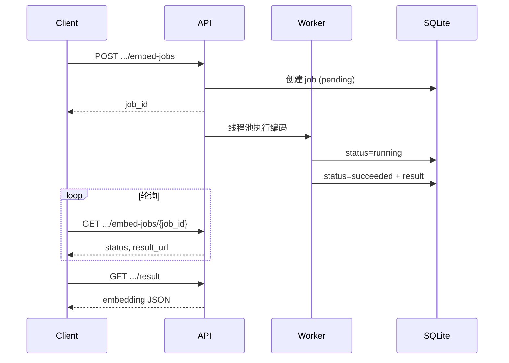

# Embedding Service API 接口文档

版本：**0.3.0**  
协议：HTTP / JSON  
框架：FastAPI

媒体与文本向量编码服务，基于 **Chinese-CLIP**（图像/视频/查询文本）与 **BGE**（描述文本）。

---

## 1. 基本信息

| 项 | 说明 |
|----|------|
| 默认地址 | `http://<host>:<EMBEDDING_SERVICE_PORT>` |
| 交互式文档 | `GET /docs`（Swagger UI） |
| 健康检查 | `GET /health` |
| 内容类型 | 请求/响应均为 `application/json` |
| 鉴权 | 无内置 Token；OSS 凭证由服务端环境变量配置 |

启动示例：

```bash
export EMBEDDING_SERVICE_PORT=8030
python start_embedding_service.py
```

---

## 2. 接口总览

### 2.1 同步接口（立即返回）

| 方法 | 路径 | 说明 |
|------|------|------|
| GET | `/health` | 健康检查 |
| GET | `/stats` | 任务与模型加载统计 |
| POST | `/v1/query/clip/embed` | 查询文本 → CLIP 向量 |
| POST | `/v1/query/bge/embed` | 查询文本 → BGE 向量 |

### 2.2 异步任务接口（提交 job → 轮询 → 取结果）

| 模态 | 方案 | 提交任务 | 查状态 | 取结果 |
|------|------|----------|--------|--------|
| 图片 | CLIP | `POST /v1/images/clip/embed-jobs` | `GET .../{job_id}` | `GET .../{job_id}/result` |
| 图片 | BGE | `POST /v1/images/bge/embed-jobs` | 同上 | 同上 |
| 视频 | CLIP | `POST /v1/videos/clip/embed-jobs` | 同上 | 同上 |
| 视频 | BGE | `POST /v1/videos/bge/embed-jobs` | 同上 | 同上 |

> **注意**：查询任务状态与取结果时，`job_id` 必须与提交时使用的路径前缀一致（例如 CLIP 图片任务只能走 `/v1/images/clip/embed-jobs/...`）。

---

## 3. 通用约定

### 3.1 媒体来源（图片 / 视频 CLIP）

图片 CLIP、视频 CLIP 通过 **阿里云 OSS** 拉取对象：

- 请求体提供 `object_key`（桶内路径）
- 桶名由环境变量 `ALIYUN_OSS_BUCKET` 指定
- 还需配置：`ALIYUN_OSS_ENDPOINT`、`ALIYUN_OSS_ACCESS_KEY_ID`、`ALIYUN_OSS_ACCESS_KEY_SECRET`

### 3.2 `return_vector` 与 `write_vector`

| 字段 | 默认 | 说明 |
|------|------|------|
| `return_vector` | `true` | 是否在 API 响应（或任务结果）中返回 `embedding` 数组 |
| `write_vector` | `false` | 是否将向量写入 Milvus（需 `VECTOR_STORE=milvus`） |

二者可独立设置：例如 `return_vector=false` + `write_vector=true` 仅入库、响应中不含向量。

### 3.3 支持的 MIME 类型

**图片** `content_type`：

- `image/jpeg`、`image/png`、`image/webp`、`image/gif`、`image/bmp`

**视频** `content_type`：

- `video/mp4`、`video/quicktime`、`video/x-msvideo`、`video/webm`、`video/x-matroska`

**查询文本** `content_type`：

- `text/plain`（默认）

### 3.4 向量维度（默认）

| 模型 | 环境变量 | 默认维度 |
|------|----------|----------|
| CLIP | `VIDEO_CLIP_DIM` / `IMAGE_CLIP_DIM` | 1024 |
| BGE | `VIDEO_BGE_DIM` / `IMAGE_BGE_DIM` | 1024 |

### 3.5 Milvus 写入集合与主键

`write_vector=true` 时写入的集合与 `pk` 规则：

| 接口 | Milvus 集合 kind | 主键 `pk` 示例 |
|------|------------------|----------------|
| 图片 CLIP | `media_image_clip` | `image_clip:image:{media_id}` |
| 图片 BGE | `media_image_bge` | `image_bge:image:{media_id}` |
| 视频 CLIP | `media_video_clip` | `video_clip:video:{media_id}` |
| 视频 BGE | `media_video_bge` | `video_bge:video:{media_id}` |

集合全名：`{MILVUS_COLLECTION_PREFIX}_{kind}_{profile}`，默认 profile 为 `default`。

---

## 4. 系统接口

### 4.1 健康检查

```
GET /health
```

**响应 200**

```json
{
  "status": "ok",
  "service": "embedding_service",
  "vector_store": "milvus",
  "clip_model_path": "/path/to/models",
  "clip_device": "cpu",
  "bge_model_name": "BAAI/bge-large-zh-v1.5",
  "bge_device": "cpu"
}
```

### 4.2 服务统计

```
GET /stats
```

**响应 200**

```json
{
  "service": "embedding_service",
  "version": "0.3.0",
  "tasks": {
    "total": 12,
    "pending": 0,
    "running": 1,
    "succeeded": 10,
    "failed": 1
  },
  "models": {
    "clip_loaded": true,
    "bge_loaded": true
  }
}
```

---

## 5. 文本向量（同步）

### 5.1 CLIP 查询向量

```
POST /v1/query/clip/embed
```

**请求体**

| 字段 | 类型 | 必填 | 默认 | 说明 |
|------|------|------|------|------|
| `query_id` | string \| null | 否 | null | 业务侧查询 ID |
| `text` | string | 是 | — | 中文查询文本 |
| `content_type` | string | 否 | `text/plain` | 文本 MIME |
| `return_vector` | boolean | 否 | true | 是否返回向量 |

**请求示例**

```json
{
  "query_id": "q-001",
  "text": "工地上作业的工人",
  "return_vector": true
}
```

**响应 200**

```json
{
  "embedding_model": "OFA-Sys/chinese-clip-vit-huge-patch14",
  "vector_dim": 1024,
  "embedding": [0.012, -0.034, "..."]
}
```

### 5.2 BGE 查询向量

```
POST /v1/query/bge/embed
```

请求体与 CLIP 相同；响应结构同为 `QueryVectorPayload`（`embedding_model`、`vector_dim`、`embedding`）。

---

## 6. 图片向量（异步）

### 6.1 图片 CLIP

#### 提交任务

```
POST /v1/images/clip/embed-jobs
```

**请求体**

| 字段 | 类型 | 必填 | 默认 | 说明 |
|------|------|------|------|------|
| `object_key` | string | 是 | — | OSS 对象键 |
| `content_type` | string | 是 | — | 图片 MIME |
| `media_id` | string | 是 | — | 业务媒体 ID |
| `return_vector` | boolean | 否 | true | 结果中是否含向量 |
| `write_vector` | boolean | 否 | false | 是否写入 Milvus |

**请求示例**

```json
{
  "media_id": "img_001",
  "object_key": "images/demo.jpg",
  "content_type": "image/jpeg",
  "return_vector": true,
  "write_vector": false
}
```

**响应 200**

```json
{
  "job_id": "550e8400-e29b-41d4-a716-446655440000",
  "status": "pending"
}
```

#### 查询状态

```
GET /v1/images/clip/embed-jobs/{job_id}
```

**响应 200（进行中）**

```json
{
  "job_id": "550e8400-e29b-41d4-a716-446655440000",
  "job_kind": "image/clip",
  "status": "running",
  "created_at": "2026-05-28T10:00:00",
  "updated_at": "2026-05-28T10:00:05",
  "progress": { "stage": "started" },
  "error": null,
  "error_type": null
}
```

**响应 200（成功）** — 额外包含：

```json
{
  "status": "succeeded",
  "result_size_bytes": 12345,
  "result_url": "/v1/images/clip/embed-jobs/{job_id}/result"
}
```

`status` 取值：`pending` | `running` | `succeeded` | `failed`

#### 取结果

```
GET /v1/images/clip/embed-jobs/{job_id}/result
```

仅当 `status=succeeded` 时可用；否则 **409**。

**响应 200**

```json
{
  "media_id": "img_001",
  "modality": "image",
  "scheme": "clip",
  "vector_dim": 1024,
  "embedding_model": "OFA-Sys/chinese-clip-vit-huge-patch14",
  "embedding": [0.01, 0.02, "..."],
  "metadata": {
    "width": 1920,
    "height": 1080,
    "source": "oss",
    "content_type": "image/jpeg",
    "bucket": "my-bucket",
    "object_key": "images/demo.jpg"
  },
  "milvus": null
}
```

`write_vector=true` 时 `milvus` 示例：

```json
{
  "collection": "chinese_clip_media_image_clip_default",
  "pk": "image_clip:image:img_001",
  "written": true
}
```

### 6.2 图片 BGE

```
POST /v1/images/bge/embed-jobs
```

**请求体**（无需 `object_key`，对文本描述编码）

| 字段 | 类型 | 必填 | 说明 |
|------|------|------|------|
| `media_id` | string | 是 | 业务媒体 ID |
| `content_type` | string | 是 | 关联图片 MIME |
| `description` | string | 是 | 图片描述文本 |
| `return_vector` | boolean | 否 | 默认 true |
| `write_vector` | boolean | 否 | 默认 false |

**结果字段**（`GET .../result`）：在 CLIP 结果基础上增加 `caption`（即输入的 `description`）。

---

## 7. 视频向量（异步）

### 7.1 视频 CLIP

#### 处理流程（服务端内部）

```
源视频 (OSS)
  → ffmpeg 按 segment_seconds 切段
  → 每段按 sample_fps 抽候选帧（最多 max_frames）
  → Chinese-CLIP 编码候选帧
  → K-means 多样性筛选 → 每段保留 top_k_frames 帧
  → 段内 softmax 池化（权重 = 帧向量 L2 范数）→ 段向量
  → 全段 softmax 池化（权重 = 段 importance_score）→ 整片向量
```

API **仅返回整片** `embedding`（1024 维），不返回帧级/片段级向量。

#### 提交任务

```
POST /v1/videos/clip/embed-jobs
```

**请求体**

| 字段 | 类型 | 必填 | 默认 | 说明 |
|------|------|------|------|------|
| `object_key` | string | 是 | — | OSS 视频对象键 |
| `content_type` | string | 是 | — | 视频 MIME |
| `media_id` | string | 是 | — | 业务视频 ID |
| `return_vector` | boolean | 否 | true | 结果中是否含向量 |
| `write_vector` | boolean | 否 | false | 写入 `media_video_clip` |
| `configuration` | object | 否 | 见下表 | 抽帧与分段参数 |

**`configuration` 默认值**

| 字段 | 类型 | 默认 | 范围 | 说明 |
|------|------|------|------|------|
| `sample_fps` | float | 1.0 | 0.1–10.0 | 每段内每秒抽候选帧数 |
| `max_frames` | int | 16 | 1–128 | 每段最多候选帧数 |
| `top_k_frames` | int | 4 | 1–32 | K-means 后每段保留帧数 |
| `segment_seconds` | int | 5 | 1–60 | ffmpeg 切段时长（秒） |

**请求示例**

```json
{
  "media_id": "video_001",
  "object_key": "videos/demo.mp4",
  "content_type": "video/mp4",
  "return_vector": true,
  "write_vector": true,
  "configuration": {
    "sample_fps": 1.0,
    "max_frames": 16,
    "top_k_frames": 4,
    "segment_seconds": 5
  }
}
```

#### 取结果

```
GET /v1/videos/clip/embed-jobs/{job_id}/result
```

**响应 200**（结构与图片 CLIP 类似）

```json
{
  "media_id": "video_001",
  "modality": "video",
  "scheme": "clip",
  "vector_dim": 1024,
  "embedding_model": "OFA-Sys/chinese-clip-vit-huge-patch14",
  "embedding": [0.01, 0.02, "..."],
  "metadata": {
    "width": null,
    "height": null,
    "source": "oss",
    "content_type": "video/mp4",
    "bucket": "my-bucket",
    "object_key": "videos/demo.mp4"
  },
  "milvus": {
    "collection": "chinese_clip_media_video_clip_default",
    "pk": "video_clip:video:video_001",
    "written": true
  }
}
```

### 7.2 视频 BGE

```
POST /v1/videos/bge/embed-jobs
```

对**视频文字描述**做 BGE 编码（不读取 OSS 视频文件）。

| 字段 | 类型 | 必填 | 说明 |
|------|------|------|------|
| `media_id` | string | 是 | 业务视频 ID |
| `content_type` | string | 是 | 关联视频 MIME |
| `description` | string | 是 | 视频描述/字幕文本 |
| `return_vector` | boolean | 否 | 默认 true |
| `write_vector` | boolean | 否 | 写入 `media_video_bge` |

**结果**：含 `caption`、`embedding`；`segments` 当前恒为空数组。

---

## 8. 异步任务生命周期



**建议轮询间隔**：3–5 秒；视频 CLIP 任务可能耗时数分钟至数十分钟。

任务持久化在 `TASK_DB_PATH`（默认 `runtime/tasks.db`），默认保留 `TASK_TTL_HOURS`（24 小时）。

---

## 9. 错误响应

### 9.1 业务错误（400）

`EmbeddingServiceError` 统一格式：

```json
{
  "error": "错误描述",
  "code": "VALIDATION_ERROR",
  "details": {}
}
```

| code | 说明 |
|------|------|
| `VALIDATION_ERROR` | 请求参数或业务校验失败 |
| `CONFIGURATION_ERROR` | 服务配置错误 |
| `MEDIA_DOWNLOAD_ERROR` | OSS 下载失败 |
| `MEDIA_PROCESSING_ERROR` | 图像/视频处理失败 |
| `MODEL_ERROR` | 模型加载或推理失败 |
| `VECTOR_STORE_ERROR` | Milvus 写入失败 |
| `TASK_LIMIT_ERROR` | 超过 `MAX_TASKS` 上限 |

### 9.2 HTTP 状态码

| 状态码 | 场景 |
|--------|------|
| 400 | 业务错误（见上表） |
| 404 | `job_id` 不存在或路径前缀与任务类型不匹配 |
| 409 | 任务未完成时请求 `/result` |
| 422 | 请求体 JSON / 字段校验失败（FastAPI） |
| 500 | 未预期服务器错误 |

### 9.3 任务失败

`GET .../embed-jobs/{job_id}` 在 `status=failed` 时：

```json
{
  "status": "failed",
  "error": "no segment embeddings generated",
  "error_type": "VALIDATION_ERROR"
}
```

---

## 10. 调用示例（curl）

### 10.1 健康检查

```bash
curl -s http://127.0.0.1:8030/health | jq .
```

### 10.2 同步 CLIP 查询

```bash
curl -s -X POST http://127.0.0.1:8030/v1/query/clip/embed \
  -H 'Content-Type: application/json' \
  -d '{"text": "红色连衣裙", "return_vector": true}'
```

### 10.3 视频 CLIP 异步全流程

```bash
BASE=http://127.0.0.1:8030

# 1. 提交
JOB=$(curl -s -X POST "$BASE/v1/videos/clip/embed-jobs" \
  -H 'Content-Type: application/json' \
  -d '{
    "media_id": "video_001",
    "object_key": "videos/demo.mp4",
    "content_type": "video/mp4",
    "write_vector": true
  }' | jq -r .job_id)

echo "job_id=$JOB"

# 2. 轮询
until [[ $(curl -s "$BASE/v1/videos/clip/embed-jobs/$JOB" | jq -r .status) == "succeeded" ]]; do
  sleep 3
done

# 3. 取结果
curl -s "$BASE/v1/videos/clip/embed-jobs/$JOB/result" | jq '.vector_dim, .embedding[:3]'
```

---

## 11. 相关文档

| 文档 | 内容 |
|------|------|
| [`README.md`](README.md) | 安装、启动、环境变量 |
| [`PARAMS.md`](PARAMS.md) | 环境变量与字段明细表 |
| [`../DEPLOY.md`](../DEPLOY.md) | 部署与打包 |
| [`../scripts/README.md`](../scripts/README.md) | 验证与 benchmark 脚本 |

在线调试：服务启动后访问 `http://<host>:<port>/docs`。
