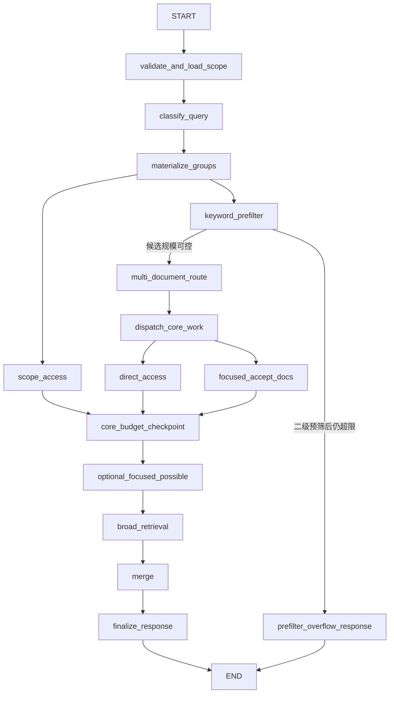

# RAG Retrieval Service v2 设计与实现计划

> 本文是新 `rag-retrieval-service` 的设计规格、接口契约和实现计划。设计已经过讨论确认。实现人员应以本文为准，从空目录开始构建，不在旧检索主流程上继续修改。

## 1. 项目定位

### 1.1 目标

新服务从 PostgreSQL 中读取 `documents`、`document_bindings`、`doc_nodes` 和 `doc_pages`，根据用户 query 规划检索过程，并把有助于下游强模型回答问题的原始证据作为 chunk 返回。

服务必须解决旧服务的两个根本问题：

1. 不再先按固定数量截断 node/page 候选，避免正确结果在 LLM 判断前已经消失。
2. 不再让 node chunk 与 page chunk 竞争。node 只用于内部导航，正文证据统一返回数据库中的 page 原文。

### 1.2 职责边界

- LLM 只做 query 分类、文档路由、目录树导航和候选 page 判断，不生成用户问题的答案。
- 服务不得总结、改写、美化或拼接 page 正文。
- 工具可以生成数据库中不存在的元信息语料，例如文档列表或标题树；这种内容必须用独立 `source_type` 标识。
- page 在最终返回前必须重新从数据库按主键读取，不能把 prompt 中的截取文本当作最终证据。
- 接口不支持 SSE。同步请求结束后一次性返回 chunks、warnings、coverage、usage 和可选 debug。
- 设计应允许未来增加异步提交/查询接口，但第一版不实现异步任务持久化。
- 第一版优先实现 LLM 参与的 `semantic` 路径；`hybrid` 作为兼容别名进入同一路径；`keyword` 暂返回明确的未实现错误，但所有节点必须预留纯规则策略，保证未来 keyword 模式全程不调用 LLM。

### 1.3 与 legacy 项目的关系

`src/rag-retrieval-service-legacy` 仅为只读参考并包含在 `.gitignore` 中。新项目禁止整体复制 legacy 的以下内容：

- `RetrievalService` 主流程及其 semantic/hybrid/keyword 路由语义；
- node/page 共同作为候选 chunk 的模型；
- 在 SQL 候选阶段使用固定 `LIMIT` 截断全文的做法；
- 让 `top_k` 参与文档候选和 page 候选硬截断的做法；
- semantic 失败后整体切换到旧 keyword 检索的主链路；
- 节点内部各自创建 LLM semaphore 的多层并发控制。

可以阅读并重新实现其中已经验证的叶子思想，但不要直接依赖 legacy 包：

- PostgreSQL scope 过滤方式；
- token 计数、上下文预算和 LPT 分组算法；
- OpenAI-compatible 请求参数；
- 轻量熔断器、错误分类和用户级 token bucket 的设计思路；
- 安全日志字段和测试场景。

新项目需要真实 Ark 烟测时，只从 legacy 的本地实际环境配置中选择性复制 `ARK_API_KEY`、`ARK_BASE_URL`、模型名、上下文窗口和调用超时等 Ark 相关值到新项目未跟踪的 `.env`。不得复制整份旧 `.env`，因为其中包含已经失效的旧流程参数；不得把真实 key 写入本文、`.env.example`、测试 fixture、日志、debug 或 Git。新 `.env` 应为 `0600`，烟测前确认其被 Git 忽略。

## 2. 必须支持的 query 范围

分类不是对整条原始 query 选一个标签，而是把复合 query 拆成若干独立问题，再按下游处理流程分组。一个请求可以同时激活四类中的多类。

| category | 路由文档 | 局部 page 搜索 | 典型目标 |
|---|---:|---:|---|
| `routed_focused` | 是 | 是 | 从少数片段中找精确事实或流程 |
| `routed_broad` | 是 | 否，强调大范围原文覆盖 | 详细总结、解释和跨文档对比 |
| `routed_direct` | 是 | 否，直接访问指定资源 | 指定页、指定章节、目录和命名文档摘要 |
| `scope_direct` | 否 | 否 | 请求 scope 的文档列表、元信息和全部文档的简要概览 |

### 2.1 元信息和指定原内容

必须覆盖：

- “简要总结这几个文档内容”。若“这几个”就是整个 request scope，进入 `scope_direct`；若需要先从 scope 中识别命名文档，进入 `routed_direct`。
- “这个文档有几页”。
- “查看某文档的章节结构”。
- “你能看到哪些文档”。
- “这篇文档的第三章在讲什么”。先定位章节，再返回该章节对应的完整 page。
- “帮我看看第 12 页有什么”。
- “这篇文档的目录是什么”。这是直接构造标题树，不应当做正文筛选。

### 2.2 局部精确检索

必须覆盖单文档或跨文档查询：

- “公司去年的营业额是多少”。
- “XXX 的流程是什么”。
- “X 的具体数值、日期或比例是多少”。
- “A 公司与 B 公司去年营业额谁多”。分类器应重写为可独立执行的“A 公司去年营业额是多少”和“B 公司去年营业额是多少”，但它们仍作为同一个 group 的平等问题共同检索。

### 2.3 大范围原文检索

必须覆盖：

- “对比文档一和文档二的差别”。
- “详细总结文档一的内容”。
- “帮我解释这篇论文”。
- “详细总结 A 与 B，并比较两者的方法”。

服务不代替下游强模型完成总结、解释或比较。它应在 `max_return_tokens` 内尽量返回覆盖各目标文档和主要章节的 page 原文。

### 2.4 复合 query

以下请求必须能够在一次调用中拆分并并行执行：

```text
你能看到哪些文档？A公司和B公司的年报存在吗？
A公司去年的营业额是多少？比B公司多还是少？
再详细比较两份年报的风险章节。
```

预期至少产生：

- 一个 `scope_direct` group：列举当前请求可见文档；
- 一个 `routed_direct` group：确认 A/B 年报并可返回文档元信息；
- 一个 `routed_focused` group：分别检索 A/B 营业额；
- 一个 `routed_broad` group：广泛返回两份年报风险章节原文。

## 3. 核心不变量

1. 分类 LLM 不生成任何 ID。`group_ref` 由代码在结构化输出校验成功后生成。
2. 系统严格保持 group 级引用，不要求文档或 page 关联 group 内某一个 query。
3. 同一 group 中的 queries 不分主次，文档路由和 page 检索都必须看到该 group 的全部独立问题。
4. 预算允许时，每个非空 group 至少保留一个结果；无法满足时必须返回顶层 warning 和不完整 coverage。
5. `top_k` 是全局软目标；`max_return_tokens` 是返回 chunk 载荷的硬预算。
6. `scope_direct`、`routed_direct`、`routed_focused` 的装载优先级高于 `routed_broad`。
7. 任意 LPT 分组只改变执行批次，不得使某些批次被忽略；所有批次进入全局队列，除非预算检查、请求 deadline 或取消逻辑明确停止后续可选工作。
8. 任意规则或 LLM 筛选必须返回 `accept`、`possible` 或 `reject`；不能用固定数量冒充语义判断。
9. 所有静默截断都禁止。文档、node、page、LLM 批次或最终结果发生丢弃时，必须有可观测的计数；影响最终证据时还必须有响应 warning。
10. 未来 `keyword` 模式的任何调用路径都不能触达 LLMGateway。
11. `core_budget_checkpoint` 之后禁止再发起 LLM 请求。optional focused 和 broad 都只能使用数据库读取、token 预算和纯代码规则，保证一个请求的 LLM 等待轮次可控。
12. 优先采用清晰的错误和有限降级，不为低概率异常建立跨 workflow 跳转或多维拆分。只有本文明确列出的 fallback 才允许执行。
13. LLM 结构化节点必须使用 OpenAI Structured Outputs 的 `response_format`；agent 工具节点必须使用 OpenAI `tools`、`strict=true` 和 Function Calling。禁止用提示词约定“输出一段 JSON”后自行解析。
14. ReAct 历史必须使用规范的 assistant `tool_calls` 与对应 `role=tool` 消息；不得把工具结果伪装成 user/assistant 文本。所有对模型可见的工具参数和结构化输出字段必须有清晰中文描述。

## 4. API 契约

### 4.1 请求模型

建议保留旧调用方已使用的字段，并增加 token 预算：

```python
class RetrieveOptions(BaseModel):
    include_document_meta: bool = True
    include_debug: bool = False
    ensure_document_coverage: bool = False


class RetrieveRequest(BaseModel):
    user_id: str
    kb_id: str
    query: str
    session_id: str | None = None
    doc_ids: list[str] = []
    temp_doc_ids: list[str] = []
    top_k: int = 5
    max_return_tokens: int | None = None
    search_mode: Literal["hybrid", "keyword", "semantic"] = "hybrid"
    options: RetrieveOptions = RetrieveOptions()
```

语义：

- `user_id + kb_id` 保留为兼容和限流字段，不参与 SQL 文档隔离；调用方负责 doc_id 权限校验。
- `doc_ids + temp_doc_ids` 是调用方指定的 request scope；服务不得检索 scope 外文档。
- `session_id` 保持可选兼容字段，不参与文档读取过滤。
- `top_k` 是全局软目标，主要决定是否继续加载 focused 的 possible 文档/page；direct 结果和 group 保底可以使返回数量超过它。
- `max_return_tokens` 是所有返回 chunk 的 `content + hint + 下游会消费的来源文本`之和的硬预算，不包含 JSON 字段名、debug 和 warning。为空时使用服务端默认值；请求值不得超过服务端绝对上限。
- `ensure_document_coverage=true` 表示在目标文档已经确定后，尽量为每篇目标文档保留一个 chunk；它不能突破 `max_return_tokens`，无法满足时返回 warning。
- 第一版 `semantic` 执行新图，`hybrid` 作为兼容别名并在 usage 中报告 `actual_mode=semantic`，`keyword` 返回 `MODE_NOT_IMPLEMENTED` 且验证没有 LLM 调用。

### 4.2 chunk 模型

内部先保存结构化 hint，响应序列化前再由代码渲染成下游易读文本：

```python
class ChunkHintData(BaseModel):
    group_refs: list[str]
    questions: list[str]
    retrieval_category: Literal[
        "routed_focused", "routed_broad", "routed_direct", "scope_direct"
    ]
    match_grades: dict[str, Literal["accept", "possible"]]
    document_name: str | None = None
    page_numbers: list[int] = []
    chapter_titles: list[str] = []
    content_truncated: bool = False
    original_content_tokens: int | None = None
    returned_content_tokens: int | None = None
```

```python
class RetrievedChunk(BaseModel):
    chunk_id: str
    document_id: str | None
    document_ids: list[str] = []
    document_name: str | None
    path: str
    content: str
    hint: str
    score: float | None
    source_type: Literal[
        "page", "scope_metadata", "document_overview", "title_tree"
    ]
    document_meta: dict | None
    chunk_meta: dict
```

- 正文类结果只允许 `source_type=page`。
- node 永远不作为公开 chunk 返回。
- `scope_metadata` 可以描述多文档，因此允许 `document_id=null` 并使用 `document_ids`。
- direct/meta 结果没有相关性分数时使用 `score=null`，不得伪造低分或高分。
- `content_truncated=true` 时，`chunk_meta` 还必须包含原始 page 标识和连续原文的字符或 token 起止位置。

### 4.3 warning、coverage、usage 和 debug

warning 是正式响应的一部分，不能只在 debug 中出现：

```python
class RetrievalWarning(BaseModel):
    code: str
    message: str
    affected_group_refs: list[str] = []
    affected_document_ids: list[str] = []
    retryable: bool = False


class CoverageSummary(BaseModel):
    complete: bool
    truncated: bool
    truncated_by: str | None
    covered_group_refs: list[str]
    uncovered_group_refs: list[str]
    degraded_group_refs: list[str]


class RetrieveUsage(BaseModel):
    candidate_document_count: int
    inspected_node_count: int
    inspected_page_count: int
    returned_count: int
    returned_tokens: int
    tokenizer: str
    latency_ms: int
    actual_mode: Literal["keyword", "semantic"] | None
    llm_request_count: int
    prompt_tokens: int
    completion_tokens: int
    total_tokens: int
```

```python
class RetrieveResponse(BaseModel):
    chunks: list[RetrievedChunk]
    warnings: list[RetrievalWarning]
    coverage: CoverageSummary
    usage: RetrieveUsage
    debug: RetrievalDebug | None = None
```

有部分完整结果时，即使发生超时、分组失败或预算截断，也返回 HTTP 200 和 warning。一个结果都没有时：整体 deadline 用 504，依赖或 LLM/数据库不可用用 503，RPM 超限用 429，不存在的指定资源按 API 最终约定使用 404 或 422。

### 4.4 文档读取兼容接口与独立路由接口

服务同时提供三个无鉴权的同步 JSON 接口，鉴权和 doc_id 权限校验由可信上游负责；接口保留基于 `user_id` 的外部请求 RPM limiter，SQL 只按 doc_id 读取文档。

- `POST /rag/v1/documents/meta`：请求 `user_id`、`kb_id`、非空 `doc_ids` 和 `include_missing`，返回旧调用方需要的文档元信息列表及 `missing_doc_ids`。批量数量受服务端 `document_meta_max_docs` 限制。
- `POST /rag/v1/documents/raw`：请求 `user_id`、`kb_id` 和单个 `doc_id`，返回 `schema_version=1.0`、文档元信息、稳定排序的 pages、重建后的 structure 和 MinerU 原始结果。`doc_id` 不存在时返回 `DOCUMENT_NOT_FOUND`；没有原始解析结果时按 raw repair 契约处理。
- `POST /rag/v1/documents/route`：请求正式/临时 doc ID 和有序 `criteria` 分组，直接复用第 8 章的文档路由器并按组返回 `accept/possible/reject`。请求级 `keyword_prefilter` 默认 `false`；关闭时构造包含全部文档、零 keyword score 的候选映射，避免 `DocumentRoutingService` 因空值重新触发内部预筛。开启时复用同一个 `KeywordPrefilterService`，不得复制或修改评分算法。

三个接口均不得引入 SSE、API Key 或额外登录态；查询只按 doc_id。route 因执行 LLM 路由而
进入与 `/retrieve` 相同的公平准入池，meta/raw 不进入。

## 5. 分类输出与图 State

### 5.1 分类 LLM 的最小输出

四个 key 必须始终存在；空类别输出空列表。模型不输出 reason、ID、依赖关系、置信分数或执行参数。

```python
class RoutedQueryGroupDraft(BaseModel):
    model_config = ConfigDict(extra="forbid")
    queries: list[str]
    target_docs_description: str
    target_docs_keywords: list[str]


class ScopeDirectGroupDraft(BaseModel):
    model_config = ConfigDict(extra="forbid")
    queries: list[str]


class QueryClassificationOutput(BaseModel):
    model_config = ConfigDict(extra="forbid")
    routed_focused: list[RoutedQueryGroupDraft]
    routed_broad: list[RoutedQueryGroupDraft]
    routed_direct: list[RoutedQueryGroupDraft]
    scope_direct: list[ScopeDirectGroupDraft]
```

校验规则：

- 每个 `queries` 非空；空 group 由代码删除。
- 每个独立问题必须能脱离原始长 query 被理解。
- `target_docs_description` 描述目标文档的身份或类型，不描述答案内容。
- `target_docs_keywords` 只包含可能出现在文档名或 `doc_description` 中的名称、别名和文档类型词。
- 同一 category 中，只有目标文档意图相同的问题才可进入同一个 group。
- 代码检查独立问题是否为空、完全重复或明显新增了原 query 不存在的任务；不得要求模型维护问题之间的 ID 引用。

分类提示词必须明确包含以下规则：

```text
重写 query 时，必须是从原 query 拆分并改写后的独立问题。
不得新增用户未提出的问题，不得回答问题。
跨文档比较必须拆成足以分别检索各文档的独立问题，并保留比较目标。
同一 group 内的问题没有主次；后续检索会把它们作为整体处理。
只有答案集中在少数原文片段时才使用 routed_focused。
详细总结、解释和比较需要大范围原文，必须使用 routed_broad。
指定页、指定章节、目录、文档摘要等直接资源使用 routed_direct。
请求 scope 的文档列表、数量、元信息或全部文档简要概览使用 scope_direct。
```

### 5.2 代码生成的 group

```python
class QueryGroup(BaseModel):
    group_ref: str
    category: Literal[
        "routed_focused", "routed_broad", "routed_direct", "scope_direct"
    ]
    queries: list[str]
    target_docs_description: str | None = None
    target_docs_keywords: list[str] = []
    ordinal: int
```

`group_ref` 按分类输出的稳定遍历顺序由代码生成，例如 `g0001`。它只用于本次 graph run 内关联结果，不表达依赖关系。模型可以选择代码已经提供的 `group_ref`，但不能产生新 ID。

### 5.3 主图 State

LangGraph reducer 必须显式定义并发分支如何合并，禁止依赖最后写入覆盖前值：

```python
class RetrievalGraphState(TypedDict):
    request: RetrieveRequest
    request_id: str
    deadline_at: float
    scope_documents: list[DocumentProfile]
    groups: list[QueryGroup]
    routes: Annotated[list[DocumentRoute], operator.add]
    candidate_chunks: Annotated[list[CandidateChunk], operator.add]
    warnings: Annotated[list[RetrievalWarning], operator.add]
    failures: Annotated[list[NodeFailure], operator.add]
    trace_events: Annotated[list[TraceEvent], operator.add]
    budget: BudgetSnapshot
    final_chunks: list[RetrievedChunk]
    coverage: CoverageSummary | None
    usage: UsageAccumulator
```

原始 page 内容不应复制进多个长期 state 字段。`candidate_chunks` 是证据唯一载体；tree frontier、工具消息和批次 prompt 属于子图局部 state，子图结束后只返回候选 chunk、统计和 trace 摘要。

### 5.4 文档路由 State

```python
class RoutedDocument(BaseModel):
    document: DocumentProfile
    grade: Literal["accept", "possible"]
    keyword_score: float
    decision_source: Literal["llm", "rule_fallback"]


class DocumentRoute(BaseModel):
    group_ref: str
    accept_docs: list[RoutedDocument]
    possible_docs: list[RoutedDocument]
    rejected_document_count: int
    prefilter_candidate_count: int
    prefilter_rejected_count: int
    degraded: bool = False
```

同一文档可以属于多个 group。路由只关联 group，不关联 group 内单个 query。

### 5.5 Focused Search 子图 State

每个 `group_ref × document_id` 使用独立子图实例：

```python
class FocusedSearchState(TypedDict):
    group: QueryGroup
    routed_document: RoutedDocument
    root_node_ids: list[str]
    frontier_nodes: list[NodeView]
    selected_nodes: list[NodeView]
    candidate_pages: list[int]
    tree_status: Literal["unknown", "usable", "unusable", "too_large"]
    tool_steps: int
    terminal_page_result: PageInspectionResult | None
    warnings: Annotated[list[RetrievalWarning], operator.add]
    trace_events: Annotated[list[TraceEvent], operator.add]
```

### 5.6 内部候选 chunk

```python
class CandidateChunk(BaseModel):
    chunk_id: str
    document_id: str | None
    document_ids: list[str]
    document_name: str | None
    page_number: int | None
    path: str
    content: str
    source_type: Literal[
        "page", "scope_metadata", "document_overview", "title_tree"
    ]
    category: str
    group_matches: dict[str, Literal["accept", "possible"]]
    questions_by_group: dict[str, list[str]]
    rule_score: float | None
    route_score: float | None
    document_meta: dict | None
    chunk_meta: dict
```

`questions_by_group` 只说明这个 chunk 来自哪个问题组的检索，不声称它逐一覆盖 group 中的每个问题。

### 5.7 各子图统一输出

除主图 State 外，每个可 fan-out 子图都应返回统一 envelope，便于 reducer 合并并避免子图直接改写全局字段：

```python
class WorkflowStats(BaseModel):
    inspected_document_count: int = 0
    inspected_node_count: int = 0
    inspected_page_count: int = 0
    llm_request_count: int = 0
    prompt_tokens: int = 0
    completion_tokens: int = 0


class WorkflowOutput(BaseModel):
    workflow: Literal[
        "document_routing", "focused_search", "broad_retrieval",
        "direct_access", "scope_access"
    ]
    group_ref: str | None
    document_id: str | None
    candidate_chunks: list[CandidateChunk]
    warnings: list[RetrievalWarning]
    failures: list[NodeFailure]
    stats: WorkflowStats
    status: Literal["ok", "degraded", "failed", "skipped"]
```

特殊结果作为该 envelope 的内部过程类型：

```python
class PageDecision(BaseModel):
    page_number: int
    grade: Literal["accept", "possible", "reject"]


class PageInspectionResult(BaseModel):
    decisions: list[PageDecision]
    evaluated_pages: list[int]
    decision_source: Literal["llm", "mixed", "rule_fallback"]


class BroadCoveragePlan(BaseModel):
    group_ref: str
    document_id: str
    ordered_pages: list[int]
    chapter_coverage: dict[str, list[int]]


class DirectToolResult(BaseModel):
    group_ref: str
    tool_name: str
    chunks: list[CandidateChunk]
```

`PageInspectionResult.evaluated_pages` 必须与输入 pages 集合完全一致。LLM 只返回选中的
accept/possible 页；未返回页由代码补成 reject。只有调用失败、重复页码或越界页码才让
对应 LPT 批次进入规则 fallback。

## 6. LangGraph 总体设计



说明：

- `scope_access` 与 routed 路径可并行。
- `keyword_prefilter` 是独立节点，内部保留原一级规则；单 group 超过候选阈值时再用身份锚点和 scope IDF 二次预筛。二级结果仍超限时，该节点在返回预算内列举相似文档名、生成澄清 hint，并直接结束图，不调用文档路由 LLM。
- 正常通过候选规模门控时，`keyword_prefilter` 和 `multi_document_route` 一次处理所有 routed groups，避免每个 group 重复调用模型。
- `focused_accept_docs` 再按 group 和文档 fan-out；每个文档内部独立维护 node tree。
- `core_budget_checkpoint` 等待 scope/direct/focused accept 三个高优先级分支完成，按真实候选内容计算已用 token 和初始剩余预算。
- `optional_focused_possible` 先根据 focused coverage、`top_k` 软目标和剩余预算决定是否执行；没有 gap 时它只是一个不访问数据库的 `skipped` 节点。执行后必须用实际选中 page 的 token 更新预算账本。
- `broad_retrieval` 随后读取更新后的真实剩余预算。只有存在 broad group、尚未超过 soft deadline 且至少能容纳一个最小 page/hint 时才执行，否则记录 `skipped`。因此 Broad 不会与 possible 分支争用同一份估算预算，也不会在 checkpoint 之前运行。
- `optional_focused_possible` 和 `broad_retrieval` 第一版都是纯代码节点；它们不得调用 LLMGateway，也不得把请求重新送回 Focused Search agent。顺序执行是预算语义，不代表必须为无工作可做的节点执行数据库查询。
- LangGraph 的 `Send` 只创建工作项；真正的 LLM 并发统一由进程级 LLMGateway 控制。
- 任意分支失败都写入 `failures/warnings` 并到达 merge，不能因为一个并行分组异常使整个图无条件中止。

## 7. 分类与 scope 加载

### 7.1 validate_and_load_scope

职责：

1. 校验请求字段、`top_k`、`max_return_tokens` 和文档 ID 数量。
2. 合并显式 `doc_ids/temp_doc_ids`，只按 doc_id 查询数据库中状态为 `ready` 的文档。
3. 未传文档 ID 时返回空 scope 错误，不允许退化为查询全库。
4. 读取用于分类和路由的轻量 `DocumentProfile`，不读取所有 page 正文。
5. 记录 scope 总数、缺失 ID、临时文档数和查询耗时。

page/node 查询直接按 doc_id 读取；需要 binding 兼容元信息时，每个 doc_id 只选择一条 binding。

### 7.2 classify_query

主策略是一次受控解码 LLM 调用，同时完成四类分类、独立问题改写、同目标文档问题分组以及 routed group 的路由参数生成。

失败后的规则策略必须保守：

- 按问号、换行和可靠标点拆分，不凭空生成比较子问题；
- 明确文档列表、页数、章节数和“有哪些文档”进入 `scope_direct`；
- 明确页码、章节、目录进入 `routed_direct`；
- 明确“详细总结、解释、对比”进入 `routed_broad`；
- 其余完整原 query 进入一个 `routed_focused` group；
- 规则无法可靠拆分时宁可保留原 query，也不能遗漏一部分用户请求。

规则降级必须产生 `CLASSIFICATION_RULE_FALLBACK` warning，并把 group 标记为 degraded。

## 8. 多文档路由

本章路由能力除用于主检索图外，现已通过 `POST /rag/v1/documents/route` 独立暴露。独立接口
只增加请求/响应适配，不改变以下预筛、窗口预算、LPT、并行判断及批次 fallback 逻辑。

### 8.1 keyword 硬预筛

第一版在 LLM 文档路由前，根据每个 group 的 `target_docs_keywords` 对 `doc_name + doc_description` 做规则评分，并直接硬排除未命中文档。这是有意进行的成本/召回实验，不得在代码中悄悄改为仅排序不排除。

建议规则分由以下可解释部分组成并归一化到 `[0, 1]`：

- 文档名完整短语命中；
- 文档名 token/字符词覆盖率；
- description 完整短语命中；
- description 关键词覆盖率；
- 文档类型词命中；
- 大小写、全半角、扩展名和常见空白归一化后的别名命中。

每个分量、总分、保留阈值和被排除原因写入 trace。硬预筛不得对 document 列表使用固定 `LIMIT`。若某 group 预筛为零，第一版按实验约定保留空结果并发出 `KEYWORD_PREFILTER_EMPTY` warning，不静默扩大 scope；离线评测必须单独统计此类假阴性。

### 8.2 LPT 分组

对预筛后的文档 description 使用 token 感知的 LPT 分组。每个 LLM 批次的预算必须包含：

```text
model_context_window
- safety_margin
- system_prompt_tokens
- 所有本批次group描述与queries
- response_schema固定开销
- documents × groups 的最坏结构化输出预算
= 可装载document description的预算
```

要求：

- 先精确计算每个文档序列化后的 token，而不是按字符数猜测。
- 所有 group 的 queries、路由描述、固定提示词和最小输出 schema 属于不可拆分固定开销。如果它们在尚未装入任何文档 description 前就超过单窗口预算，立即返回 `QUERY_TOO_LONG_OR_INVALID`（HTTP 422）；不沿 group 维度分片，也不尝试多轮拼接判断。
- LPT 得到的批次数不受 LLM 并发数限制；所有必需批次排队执行。
- 单个文档 description 超过 item 预算时，只保留文档名、类型和 description 的固定 token 前缀作为路由视图，并在 trace 中记录 `description_truncated=true`。不设计前后窗口拼接或递归摘要。
- 每个批次只输出其挑出的 `accept/possible` 组合；未输出组合由代码补成 `reject`。
- 分组离散判断后不要求再做一次全局 LLM 重排；代码按 grade、keyword score、文档名和 doc_id 稳定合并。

弱模型的路由输出只包含代码提供的引用：

```python
class DocumentRouteDecision(BaseModel):
    group_ref: str
    doc_id: str
    grade: Literal["accept", "possible"]


class DocumentRouteBatchOutput(BaseModel):
    decisions: list[DocumentRouteDecision]
```

代码必须验证输出 `(group_ref, doc_id)` 是本批次输入集合的无重复子集。未输出项是正常的
隐式 reject；重复项、新增 ID 或调用失败时，对该批次执行规则 fallback。不要让模型输出
reason，以降低受控解码难度和无关负例的输出 token。

### 8.3 路由判断语义

- `accept`：文档名或 description 明确说明它是该 group 的目标文档。
- `possible`：可能包含答案或与目标相关，但仅凭 metadata 无法确认。
- `reject`：能够确认不属于目标。

某个 LPT 批次失败时，只对该批次使用规则 fallback：高精度精确名称/别名命中为 `accept`，超过预筛阈值的其余文档为 `possible`。不能让一个批次失败阻断其他批次。

如果整个 LLM 路由关键节点不可用，则所有 group 使用 keyword 预筛结果构建规则路由，并产生 `DOCUMENT_ROUTING_RULE_FALLBACK` warning。

### 8.4 accept 与 possible 调度

- routed groups 的 accept 文档属于核心工作，优先调度。
- direct group 没有 accept 时，可按 keyword score 选择必要数量的 possible 文档以解析指定资源；否则 direct query 会完全失效。
- focused possible 文档只在核心 checkpoint 后按分数逐波加入，但走纯规则 page 检索，不再执行 tree agent 或 page LLM。
- 当所有 focused group 已经有结果且高优先级结果数量达到 `top_k`，或剩余 `max_return_tokens` 无法容纳一个估算 page 时，不再调度 focused possible 文档。
- 未达到软目标时，按 `keyword_score` 降序、小批次调度 possible 文档；每波结束后用实际候选结果重新计算预算，禁止预先固定截取 possible 前 N 篇。
- broad 不受 `top_k` 限制，但只能使用高优先级结果和 optional focused possible 实际装载完成后的剩余 token 预算。

## 9. Focused Search 子图

### 9.1 初始化

每个 `group × document` 独立执行：

1. 读取文档根节点集合。文档可能是 forest，不能假设永远只有一个 root。
2. 代码预先调用 `scan_node_tree(doc_id, root_node_id, level=1)`。
3. 代码构造一条合法的 assistant `tool_calls` 记录，再把每个扫描结果写成与 `tool_call_id` 对应的 `role=tool` 消息；不能孤立插入 tool 消息。
4. LLM 第一次工作时已经能看到一级结构，不需要先浪费一轮请求查看根节点。

### 9.2 tree agent 决策

```text
if 标题树不可用:
    代码展开整篇页码并进入 PageInspector
elif 当前候选页码池仍然过大:
    并行调用多个 scan_node_tree 继续扫描选中父节点
else:
    调用 finish_tree_navigation(finished)，由代码展开候选 node 的页码并集
```

tree agent 提示词必须要求：

- 同时服务 group 中的全部 queries，不得只处理第一条或最容易的问题；
- node summary 只用于选择范围，不能作为最终答案 chunk；
- 发现标题混乱、层级异常、summary 与 query 无法建立可靠关系时主动退化为全篇 page 遍历；
- 选择多个不相邻 node 时合并其所有页码，不能用一个连续 min/max 范围代替；
- 目录树已缩小到合适范围时调用 `finish_tree_navigation(finished)`；树不可用时调用 `finish_tree_navigation(fallback_full_document)`；不得自行输出答案或 page 内容；
- LLM 不得维护、计算、传入或输出 page 数组。它只选择已经出现的 node_id；候选页码始终由代码根据 node 范围展开；
- 只能引用工具已返回的 node_id 和代码提供的 group_ref。

### 9.3 scan_node_tree

```python
scan_node_tree(
    root_node_id: str,
    level: int,
) -> NodeTreeScanResult
```

这是对单文档隔离 agent 暴露的 Function Calling 参数；`doc_id` 已由子图实例固定，不允许模型选择或改写。工具使用 OpenAI `tools` 且 `strict=true`。

返回平铺 `NodeView`：

```python
class NodeView(BaseModel):
    node_id: str
    parent_node_id: str | None
    title: str
    summary: str
    level: int
    start_page: int
    end_page: int
    child_count: int
```

工具还返回 `status=ok|too_large|unusable`、`result_complete` 和覆盖范围。结果过大时不得返回前 N 个 node 假装完整；应返回 `too_large`，由 agent 缩小父节点或退化到 page 遍历。

入库服务保证 node summary 的语义与它标记的起止 page 内容对应，因此第一版只需轻量 locator 校验：页码为正、起止顺序正确、页码存在于该文档。校验失败的 node 不参与直接页码映射，并产生 trace；大量失败时把 tree 标为 unusable。

### 9.4 代码持有的 PageInspector

```python
PageInspector.inspect(
    doc_id: str,
    pages: list[int],
    group_ref: str,
) -> PageInspectionResult
```

PageInspector 不是 tree agent 可见的 Function Calling 工具。tree agent 结束后，代码根据 frontier 或全文范围生成 pages 数组并直接调用它；因此大量 page 编号不会进入 tree agent 的输出契约，也不会被模型遗漏或编造。page 判断节点使用严格 Structured Outputs `response_format`。

要求：

1. 对 pages 去重、排序并验证范围；数组可以不连续。
2. 从数据库读取数组中的每一页，不使用固定 SQL `LIMIT`。
3. 按完整 page 序列化 token 数执行动态 LPT 分组。
4. 每组在独立 LLM context 中对该 group 的全部 queries 挑出 `accept/possible` page，
   未挑出的 page 由代码补为 `reject`。
5. 单个 page 超过模型输入窗口时，仅在内部判断阶段切成有重叠的连续窗口；任一窗口 accept，则完整 page 为 accept；没有 accept 但有 possible，则完整 page 为 possible。
6. 某个 LPT 组失败时，对该组所有 page 执行纯规则评分，不影响其他组。
7. 汇总后重新按 `doc_id + page_number` 从数据库读取 accept/possible 的完整 page，构造候选 chunk。

PageInspector 是 Focused Search 的代码级终点。结果直接写入子图输出 state，随后子图结束，不把 page 原文或判定结果追加回 tree agent history。这避免 page 内容挤占 tree agent 上下文。

page 判断的规则 fallback 复用第 13.5 节的简单 keyword scorer：规范化后的完整 query、term 命中、有限词频和轻量 metadata 命中。高阈值为 accept，中阈值为 possible，其余 reject。不额外实现实体识别、数值邻近或独立 BM25 服务；阈值和分项必须可测试、可配置、可 trace。

page LLM 输出只包含被挑中的输入页码和 `accept/possible` grade，不输出摘录、理由或新
page ID。代码验证输出页码是输入集合的无重复子集；遗漏是正常的隐式 reject，重复或越界
页使对应批次进入规则 fallback 并记录 invalid response。

## 10. Broad Retrieval 子图

`routed_broad` 的目标不是定位少数高分 page，而是在剩余预算内最大化目标文档和主要章节覆盖。

`broad_retrieval` 位于 `core_budget_checkpoint` 和纯规则 `optional_focused_possible` 之后。checkpoint 先扣除 scope/direct/focused accept 高优先级结果，possible 节点再按实际装载结果更新同一个 token 账本，Broad 最后读取 `remaining_return_tokens`。剩余预算不足以放入一个最小 page/hint 时，Broad 直接 skipped，并为受影响 group 返回 `BROAD_SKIPPED_NO_BUDGET` warning。这里不增加第二个复杂 checkpoint，也不做预测性预算分配；每个节点只对已经实际产生的 chunk 精确计数。

第一版运行时只装配 `RuleBroadRetrievalStrategy`，不得调用 LLMGateway。可以保留与它相同接口的 `LLMBroadRetrievalStrategy` 扩展点；即使实现，也必须受默认关闭的 feature flag 控制，第一版生产 factory、集成测试和验收路径均不得启用。

规则计划保持简单，每篇 accept 文档按以下顺序处理：

1. 读取目标文档全部 page 和一级 node 到 page 的映射，不使用 SQL `LIMIT`。
2. 用一个小型、可配置的精确标题 denylist 排除明显 boilerplate，例如“封面”“目录”“目次”“前言”“序言”“致谢”。只做标题规范化后的精确匹配，不构造复杂语义分类器。
3. 如果过滤会使文档没有任何 page，则撤销该文档的过滤，避免空结果。
4. 过滤后所有 page 连同 hint 能装入剩余预算时，按原页序返回近乎全文。
5. 装不下时，先在 `group × document` 之间轮转，再从每个一级章节按原页序选择一个代表 page。
6. 仍有预算时，按 group queries 与 page 的简单 keyword 规则分补入其余 page；分数相同时按 page number。
7. tree 不可用时跳过章节轮转，按文档均匀选择 page，再按规则分补入。

Broad 不进行 accept/possible 的新一轮 LLM 判断。它根据 possible 节点更新后的硬剩余预算直接生成有序的完整 page 候选，并把未装入的文档/page 数写入 warning 和 trace。merge 仍负责跨类别最终去重与极端 token 校正。

## 11. Direct Access 与 Scope Access

### 11.1 工具契约

工具返回值就是候选 chunk，LLM 只选择工具和参数，不生成 chunk content。

#### get_docs_metainfo

```python
get_docs_metainfo(
    selection: Literal["all", "count_only", "explicit"],
    doc_ids: list[str],
    return_metainfo_types: list[
        Literal["doc_name", "page_count", "chapter_count"]
    ],
) -> CandidateChunk
```

不使用“把 0 或 infinite 填进 list[str]”这种不稳定契约。工具由代码生成一条 `scope_metadata` chunk。scope 文档列举默认使用服务端常量 `SCOPE_ENUMERATION_LIMIT=10`；用户明确指定数量时由工具按请求范围取最小值，未指定时实际展示数为 `min(10, scope_document_count)`。

#### get_docs_description

```python
get_docs_description(doc_ids: list[str]) -> list[CandidateChunk]
```

每篇文档返回独立 `document_overview` chunk，内容来自数据库 `doc_description`，可添加固定来源前缀但不得由检索 LLM重新总结。`doc_description` 是简要概览，不得用于替代详细总结所需的 broad page 原文。用于“总结上述所有文档”等 scope 列举场景时，只读取稳定排序后的前 `min(10, scope_document_count)` 篇，不为其余文档生成 description chunk。

#### get_content_of_pages

```python
get_content_of_pages(pages_by_doc: dict[str, list[int]]) -> list[CandidateChunk]
```

不同 page 返回独立 `page` chunk。所有 page 必须完整读取、验证 scope 和页码；预算裁剪只在 merge 发生。

#### get_content_of_chapters

```python
get_content_of_chapters(nodes_by_doc: dict[str, list[str]]) -> list[CandidateChunk]
```

node 仅用于解析页码范围。最终按去重后的 page 列表返回 `page` chunk，不返回 node summary/text 作为正文证据。

#### view_doc_title_tree

```python
view_doc_title_tree(
    doc_ids: list[str],
    level: int,
    parent_node_ids: list[str],
    include_node_id: bool,
) -> list[CandidateChunk]
```

每篇文档返回独立 `title_tree` chunk，content 是严格 JSON 文本，至少包含 title、summary、children；需要后续章节访问时 `include_node_id=true`。

### 11.2 文档列举上限

凡是回答“有哪些文档”“总结上述所有文档”“列出各文档页数/章节数”等需要枚举 scope 文档的场景，都遵循同一个简单规则：

1. 文档顺序优先沿用请求 `doc_ids`、再沿用 `temp_doc_ids`；未显式传 ID 时按 `doc_name + doc_id` 稳定排序。
2. 总数和可访问性基于完整 request scope 计算。
3. 用户未明确数量时，content 只列举前 `min(10, scope_document_count)` 篇。
4. content 和渲染后的 hint 都必须包含等价说明：

```text
当前请求范围内的所有文档均可访问；此处仅列举其中若干篇作为示例。
如需查看其他文档，请询问用户希望具体访问哪一篇文档。
```

5. 当 scope 超过默认的 10 篇时返回 `SCOPE_ENUMERATION_TRUNCATED` warning，并记录总数与展示数。对于“总结所有文档”，coverage 标记为不完整，因为默认只提供 10 篇 description；这是主动的响应体保护，不再尝试用 LLM 选择“最有代表性”的文档。

是否应用默认 10 篇上限取决于 doc_ids 是否由“展开整个 request scope”得到，而不取决于具体工具名。任何工具或 planner 只要准备逐篇列举完整 scope，包括元信息、description 或逐篇标题树，都必须先由代码选出稳定排序的前 10 篇，再读取逐篇内容；禁止先读取所有 description/page 后在响应阶段才截断。文档总数等聚合信息仍基于完整 scope 计算。

该默认上限不约束用户明确点名的文档、页或章节。此时不得为了套用 10 篇规则而丢弃指定资源，而由 `max_return_tokens` 和 merge 统一处理，并在丢弃时警告。

### 11.3 scope_access agent

只接收 `scope_direct` groups 和完整 request scope，可调用 `get_docs_metainfo`、`get_docs_description`。它不能调用正文搜索工具，也不能把工具结果重新组织成答案。

规则 fallback 能覆盖：文档数量、文档名列表、页数/章节数以及“简要总结所有请求文档”。所有枚举结果强制执行 4 篇上限。无法从明确模式确定工具时，丢弃该 group 的 scope 分支并返回 `SCOPE_TOOL_PLANNER_FAILED` warning，不编造语料，也不跳转其他 workflow；其他 group 已有结果时该 warning 随部分结果返回。

### 11.4 direct_access agent

接收 routed direct group 和路由文档，可调用全部 direct 工具。典型流程：

- 指定页：直接 `get_content_of_pages`。
- 指定章节：先 `view_doc_title_tree(include_node_id=true)`，再 `get_content_of_chapters`。
- 目录/章节结构：`view_doc_title_tree`。
- 命名文档简要总结：`get_docs_description`。
- 文档是否存在、页数、章节数：`get_docs_metainfo`。

规则 fallback 只解析明确文档名、阿拉伯/中文页码、章节序号、目录和元信息关键词。LLM direct planner 失败时只尝试一次确定性 planner；如果规则仍无法产生合法工具调用，则立即丢弃该 group 的 direct 分支并返回 `DIRECT_TOOL_PLANNER_FAILED` warning。其他 group 已有结果时该 warning 随部分结果返回。禁止跳转到 focused、禁止猜测 node_id，也不建立递归、二次分类或额外 LLM 重试链。

## 12. 执行策略抽象与 keyword 扩展

不建议为了复用而建立很深的抽象基类继承树。使用小型 `Protocol`、组合式 fallback 和策略工厂更清晰：

```python
InputT = TypeVar("InputT")
OutputT = TypeVar("OutputT")


class NodeStrategy(Protocol, Generic[InputT, OutputT]):
    async def execute(self, data: InputT, context: ExecutionContext) -> OutputT:
        ...


class FallbackStrategy(Generic[InputT, OutputT]):
    def __init__(
        self,
        primary: NodeStrategy[InputT, OutputT],
        fallback: NodeStrategy[InputT, OutputT],
    ) -> None:
        ...


class StrategyFactory(Protocol):
    def classifier(self, mode: SearchMode) -> NodeStrategy: ...
    def document_router(self, mode: SearchMode) -> NodeStrategy: ...
    def tree_navigator(self, mode: SearchMode) -> NodeStrategy: ...
    def page_inspector(self, mode: SearchMode) -> NodeStrategy: ...
    def direct_planner(self, mode: SearchMode) -> NodeStrategy: ...
    def broad_retrieval(self, mode: SearchMode) -> NodeStrategy: ...
```

实现规则：

- semantic 使用 `FallbackStrategy(LLMStrategy, RuleStrategy)`。
- hybrid 第一版复用 semantic factory，但记录 requested/actual mode。
- keyword 未来只装配 RuleStrategy；其 dependency graph 中不应存在 LLMGateway。
- broad retrieval 第一版无论 semantic/hybrid 都固定返回 `RuleBroadRetrievalStrategy`；LLM 版本即使存在也不进入默认 factory。
- node 函数只负责从 State 取输入、调用 strategy、把输出转换为 state update；不要把 prompt、SQL、fallback 和 trace 全部写进一个 LangGraph node 函数。
- fallback 由统一装饰器/组合器记录 `primary_failure`、fallback 耗时和降级 warning，避免每个节点复制 try/except。
- 规则 strategy 是正式实现并拥有独立测试，不是返回空列表的占位代码。

第一版 keyword API 虽不交付，但上述规则策略会被 semantic fallback 使用。因此未来实现 keyword 模式主要是增加纯规则图编排，而不是重写每个节点。

## 13. Merge 与返回预算

### 13.1 canonical 去重

所有候选类型统一按 `content` 字符串严格相等去重。实现可以利用语言运行时的字符串 hash，
但必须同时依赖字符串相等判断，不能只比较可能碰撞的摘要值。不同 group、chunk ID、文档或
页码只要正文完全一致，就只返回一个代表 chunk；不做空白归一化或语义近似去重。

同一个 `(document_id, page_number)` 如果出现不同 content，仍视为内部数据不一致并抛错，
不能把两份冲突正文同时返回。

重复候选合并时：

- `group_matches` 对每个 group 取更高 grade：`accept > possible`；
- `questions_by_group` 去重并保持分类顺序；
- 非空 `hint` 按稳定顺序去重后拼接，完全相同的 hint 只保留一次；
- `document_ids` 合并去重，使完全相同正文仍能满足多个目标文档的 coverage；
- rule/route score 取可解释的最大值；
- 展示用 document/page/source metadata 从 category 优先级和稳定来源键最小的代表 chunk 继承；
- 同一个 chunk 只计算一次返回 token，但可以同时满足多个 group 的覆盖。

### 13.2 token 计数

在最终选择前，先用与部署配置一致的 tokenizer 计算每个序列化 chunk 的消费：

```text
content tokens
+ 最终渲染hint tokens
+ document name/path/page等下游会拼入prompt的来源文本tokens
```

`max_return_tokens` 不计算 debug、warnings 和 JSON key；响应 usage 必须返回 tokenizer 名和实际 `returned_tokens`。token counter 是单例无状态服务，不能在各节点使用不同编码。

### 13.3 选择顺序

merge 第一版完全由代码执行，不调用 LLM。总体装载顺序：

```text
scope_direct
-> routed_direct
-> routed_focused
-> routed_broad
```

确定性算法：

1. 规范化并 canonical 去重。
2. 计算每个 group 的候选数量和每个 chunk 的 token 成本。
3. 对前三个高优先级类别执行 group 覆盖轮转：候选最少的 group 先选一个最佳 chunk；共享 chunk 可同时覆盖多个 group。
4. 装入 direct 的其余原子结果。指定多个页/章节时它们都是必要资源，不受 `top_k` 限制。
5. 装入 focused accept chunks；同 grade 下按 group 稀缺度、route score、rule score、文档覆盖增益、page_number、chunk_id 稳定排序。
6. 若 focused 返回数量尚未达到 `top_k`，再装入 focused possible chunks。
7. 使用剩余预算装入 broad：先在 `group × document` 间轮转，再在主要章节间轮转，最后按 broad coverage rank 填充。
8. 渲染结构化 hint，重新精确计数；若渲染开销导致超限，进入极端预算处理。
9. 生成 coverage、warnings 和 usage。

`top_k` 只决定 focused possible 的软停止点。scope/direct/focused accept/group 保底可以使总 chunk 数超过 top_k；broad 即使此时已经超过 top_k，也可以使用剩余 token 预算继续扩大覆盖。

### 13.4 大 group 向小 group 出让共享 chunk

不删除共享关系，而是把共享 chunk 的选择优先权归给候选最稀缺的 group：

```text
scarcity(group) = 1 / max(1, canonical_candidate_count(group))
```

共享 chunk 的 coverage gain 是它能新覆盖的 group 数与稀缺度之和。选择该 chunk 后，所有 `group_matches` 中的 group 都标记为 covered。这样小 group 不会因为大 group 拥有大量候选而失去唯一共享证据，同时 hint 仍保留它对大 group 的适用性。

### 13.5 possible docs 与 possible chunks

Focused accept 文档全部完成后执行 provisional merge，得到：

```text
soft_gap = max(0, top_k - 当前全部高优先级canonical chunk数)
uncovered_focused_groups = 尚无任何accept/possible chunk的focused groups
remaining_tokens = max_return_tokens - 高优先级已选结果tokens - safety_reserve
```

当 `uncovered_focused_groups` 非空或 `soft_gap > 0`，且 `remaining_tokens` 能容纳一个估算 page 时，才调度 possible docs。先为 uncovered group 按 keyword 预筛分选择 possible 文档，再补充其他 group。该节点直接读取被选 possible 文档的全部 page，并使用纯代码 keyword 规则逐页打分；不得调用 tree agent、`inspect_pages` 的 LLM strategy 或任何 LLMGateway 方法。每个小批次完成后重新计算真实 gap、覆盖和 token。估算 page token 使用该文档 page token 分布的中位数，没有统计时使用服务端保守默认值。

possible page 选择规则：

- 使用与 legacy keyword 相同层次的简单分词：英文/数字 token、中文连续串和 2/3/4 字符 n-gram，并排除少量固定停用词；
- 完整 query 在 page content 中命中获得最高加分；
- query term 在 page content 中命中并按有限词频加分，词频设置小型上限，避免重复文本支配排序；
- query/term 在文档名、page 所在 node title 等轻量 metadata 中命中获得较低加分；
- route keyword score 只作为同分 tie-breaker，不能单独使正文零命中的 page 入选；
- 分数相同时优先尚未覆盖的文档，再按页码和 chunk_id。

第一版规则只参考 legacy keyword 排序中已经验证的规范化、完整短语、term 命中和有限词频加分思想，不额外引入实体识别、数值邻近模型、BM25 服务或其他复杂特征。代码重新实现为独立模块，不复制 legacy 主流程。所有参与的 page 都必须实际评分，不先取数据库前 N 页。权重和阈值集中在 ranking 配置中；测试固定输入时必须有稳定顺序。该阶段发生在 checkpoint 后，因此必须有测试断言新增 LLM call 数为 0。

### 13.6 极端预算不足

如果高优先级结果本身已经超过硬预算，按以下顺序反向淘汰：

```text
broad低优先级page
-> broad其余非保底page
-> focused possible
-> focused accept中的非group保底page
-> focused group保底page
-> routed_direct
-> scope_direct
```

任何 group 保底、direct 或 scope 结果被丢弃，都必须加入对应 `affected_group_refs` 的 `RESULT_TOKEN_BUDGET_EXCEEDED` warning，并设置 `coverage.complete=false`。

若删到只剩原子保底结果仍无法满足预算，允许返回带 `content_truncated=true` 的连续原文片段：

- 只能做连续截取，不允许摘要、重写或拼接不连续文本；
- focused page 优先保留规则命中位置周围的最大连续窗口；没有定位信息时从原文开头截取；
- 记录原始/返回 token、字符起止 offset、原始 page chunk ID；
- broad 优先丢弃整页，只有它已经成为该 group 唯一结果时才截取；
- scope metadata 优先减少列举项目并保留总数说明；
- title tree 优先降低展示层级；
- 每次内容截取都返回 `ATOMIC_CHUNK_CONTENT_TRUNCATED` warning。

如果连最小连续片段及其来源 hint 都不能装入预算，则丢弃该结果并报告 uncovered group，不能返回空 content chunk。

## 14. 失败、降级与 fallback

### 14.1 统一执行结果

每个 strategy 返回或包装为：

```python
class NodeExecutionResult(Generic[OutputT]):
    status: Literal["ok", "degraded", "failed", "skipped"]
    output: OutputT | None
    warnings: list[RetrievalWarning]
    failure: NodeFailure | None
    fallback_used: bool
    coverage_complete: bool
```

失败分为批次局部失败、节点主策略失败和请求级失败。局部失败不得自动升级为整图失败。

### 14.2 fallback 矩阵

| 节点 | 纯代码 fallback | 降级结果 |
|---|---|---|
| 四类分类 | 保守分句和高置信意图规则 | 不确定内容整体进入 focused |
| keyword 预筛 | 本身为代码 | 数据库失败时无法兜底 |
| 多文档路由 | keyword score 和名称规则 | 精确命名为 accept，其余预筛命中为 possible |
| scope tool planner | 元信息/简要概览明确模式 | 调用确定性 scope 工具 |
| direct tool planner | 页码、章节、目录、文档名规则 | 规则仍失败则丢弃 direct 分支并告警，不跳转 focused |
| tree navigation | node title/summary 规则 | 失败时全篇 page 遍历 |
| page inspection | 联合 query lexical/rule score | 输出 accept/possible/reject |
| broad coverage | 第一版本身就是纯代码 | 过滤明显 boilerplate 后按全文/章节轮转/keyword 分装入 |
| merge/hint | 本身为代码 | 不依赖 LLM |

真正无法代码兜底的情况：

- 无法查询 request scope 或 page 数据；
- 指定文档、页或章节确实不存在；
- LLM 不可用且规则也无法把含糊引用解析到任何资源；
- group 固定描述和 schema 开销已经超过模型单窗口预算；
- 请求在产生任意完整结果前达到硬 deadline；
- 图 state、数据库记录或工具契约出现不可恢复的不一致。

### 14.3 LPT 局部失败

多文档路由和 `inspect_pages` 都遵循：

```text
某一LPT组LLM失败
-> 对该组执行规则strategy
-> fallback成功：保留结果并标记degraded
-> fallback失败：丢弃该组，记录影响的doc/page/group
-> 其他组继续执行
```

不得因一组 schema 校验失败取消 `asyncio.gather` 中其他组。使用 `return_exceptions=True` 或等价的显式任务收集，并把异常归一化为安全的 `NodeFailure`。

## 15. 全局 LLMGateway、并发与公平性

### 15.1 唯一调用入口

应用进程中只能构造一个共享 `LLMGateway`。所有 classifier、router、tree agent、page inspector 和 direct/scope planner 都通过依赖注入获得同一实例：

```python
class LLMGateway(Protocol):
    async def complete_json(self, request: LLMRequest) -> LLMResult: ...
```

Gateway 负责：

- 全局 provider 并发上限；
- 有界排队和每请求最大在途任务数；
- 按 request_id 的近似轮转公平调度；
- 受控解码、严格 JSON Schema、严格 Function Calling、单次超时和有限重试；
- 熔断；
- 排队等待、provider 耗时和 token usage；
- 请求取消后从队列移除尚未执行的任务。

节点内部可以限制自己创建本地任务的速度，但禁止再创建 provider semaphore。测试必须断言所有 LLM strategy 持有相同 gateway 对象，并用并发 fake provider 验证峰值调用数不超过配置。

### 15.2 OpenAI 调用契约

- 分类、文档路由和 page 判断等“返回结构化判定”的节点使用 `response_format={type: json_schema, json_schema: {strict: true, ...}}`，不得同时传 `tools`。
- direct/scope planner 和 tree agent 使用 OpenAI `tools`。每个 function 定义必须包含明确中文 `description`，参数 schema 及其嵌套 object 均设置 `additionalProperties=false`，每个字段都有中文 description，function 自身设置 `strict=true`。
- 工具节点要求 provider 返回 `message.tool_calls[].function.arguments`；参数由 JSON parser 和 Pydantic/显式规则校验。禁止从 assistant 自然语言 content 中提取 JSON 或工具名。
- ReAct 续轮历史保存原始 assistant tool call 及对应 `role=tool` 结果。工具返回内容只包含下一步规划需要的有界结构，不包含最终 page 正文。
- debug 关闭时 Gateway 不读取 provider usage，不建立逐调用记录，也不计算 queue/provider duration；这些诊断不能成为模型调用的隐性固定成本。

### 15.3 有界队列

单个复杂请求可能产生大量 page 批次。调度器至少包含：

- `global_max_concurrency`；
- `global_max_queued_calls`；
- `per_request_max_in_flight`；
- 按 request_id 分队列并轮转取任务。

全局队列满且无法在请求 deadline 前排入时，当前 LLM call 立即返回可分类的 overload 错误，由节点执行规则 fallback；如果最终无结果，接口返回 503。不能无限等待并占用 HTTP 连接。

第一版明确为单进程、单实例部署，进程内并发池就是全局池。若未来启用多个 worker/副本，此保证自动变为每实例上限，届时才需要外部分布式配额；第一版不引入 Redis。

## 16. 熔断器与超时

### 16.1 轻量熔断器

按 `provider + model` 维护：

```text
closed --连续基础设施失败达到阈值--> open
open --冷却结束--> half_open
half_open --单个探测成功--> closed
half_open --探测失败--> open
```

计入连续失败：连接错误、provider timeout、429、5xx 和连接中断。不计入：单个 query 的 schema/invalid response、调用方取消、请求自身 deadline 和业务上的空结果。

open 状态下，排队任务不继续冲击 provider，立即进入各节点规则 fallback。熔断状态变化写入日志和 debug，但不暴露 provider 响应正文。

### 16.2 三层时间预算

- `provider_call_timeout`：限制单次模型调用。
- `request_soft_deadline`：停止启动新的 possible docs、possible pages 和 broad 扩展。
- `request_hard_deadline`：取消本请求剩余任务并进入 finalization。
- 另外必须从硬 deadline 中预留 `finalization_reserve`，确保 merge、token 截断和响应序列化有时间完成。

软 deadline 后：

- 必需 LPT 组若已在执行，允许在剩余时间内结束；
- 尚未开始的可选扩展任务取消；
- 合并已有结果并添加 `REQUEST_SOFT_DEADLINE_REACHED` warning。

硬 deadline 后：

- 从全局 LLM 队列移除本请求任务；
- 取消本请求未完成的 DB/LLM 子任务；
- 有候选结果则 HTTP 200 partial；无结果则 504。

## 17. 用户 RPM 限流与调用边界

- RPM 限制外部检索 API 请求数，不统计内部 LLM call 数。
- 第一版使用进程内 token bucket，key 严格为请求中的 `user_id`；同一用户经不同 caller 发起请求时共享额度。
- 本服务不实现 API Key 或其他接口鉴权；它部署在可信上游之后，由上游完成身份认证并传入可信 `user_id`。
- 调用方负责完成身份认证和 doc_id 权限校验；检索服务不再通过 SQL scope 防止越权。
- limiter 需要 TTL/定期清理，避免 `_buckets` 随历史用户无限增长。
- 超限返回 429 和 `Retry-After`，请求不得进入 LangGraph 或 LLM 队列。
- 限流和 LLM 并发均为单进程语义，部署必须保持一个 Uvicorn worker。

## 18. Trace、日志与 debug

### 18.1 原则

第一版只实现进程内轻量 `TraceCollector`，不上传 LangSmith。应用启动时明确关闭 `LANGSMITH_TRACING` 和 `LANGCHAIN_TRACING_V2`；LangGraph 的传递依赖即使包含 LangSmith 包，也不得注册 callback 或产生网络上传。

接口不使用 SSE。graph 完成或部分终止后，一次性把安全的 trace 摘要放入现有 `debug` 字段。

debug 必须由服务端 `RAG_DEBUG_ENABLED` 与请求 `options.include_debug` 双开关共同启用。任一开关关闭时，不创建 TraceCollector，不计算 node input/output 摘要、group/document trace 列表、LLM usage 记录、queue wait 或 provider duration，也不读取 provider usage；只保留完成正式响应所必需的最小计数和结构化服务日志。

### 18.2 TraceEvent

```python
class TraceEvent(BaseModel):
    sequence: int
    node: str
    phase: str
    status: Literal["started", "ok", "degraded", "failed", "skipped"]
    started_at: str
    duration_ms: int | None
    input_counts: dict[str, int]
    output_counts: dict[str, int]
    group_refs: list[str]
    document_ids: list[str]
    fallback_used: bool
    error_category: str | None
    llm: SafeLLMCallSummary | None
```

`SafeLLMCallSummary` 记录 model、phase、LPT group index/count、queue wait、provider duration、prompt/completion tokens、provider request id 和安全错误分类。

### 18.3 debug 响应

仅当服务端 `RAG_DEBUG_ENABLED=true` 且请求 `options.include_debug=true` 时返回：

```python
class RetrievalDebug(BaseModel):
    request_id: str
    graph_run_id: str
    requested_mode: str
    actual_mode: str | None
    state_summary: dict[str, object]
    node_durations_ms: dict[str, int]
    trace: list[TraceEvent]
```

`state_summary` 只包含 group 数、各类 group 数、route accept/possible/reject 数、检查 node/page 数、候选/返回数、失败和降级计数。禁止直接 dump 整个 LangGraph state，因为其中可能有全文和用户敏感 query。

即使 debug 关闭，顶层 warnings、coverage 和 usage 的契约字段仍返回；其中只填充正常执行已经产生或响应必须计算的数据，不为填充诊断字段额外遍历 state 或读取 provider usage。服务端结构化日志仍按 request_id 记录请求完成、错误和熔断变化。

### 18.4 安全限制

任何日志和 debug 都不得包含：

- Ark/API Key、Authorization header；
- PostgreSQL DSN；
- 完整 prompt、模型 reasoning 或 provider 错误正文；
- 无界 page/content、完整 document description；
- 服务端本地路径或 OSS 凭证。

第一版没有生产 LangSmith 开关。未来若引入外部 trace 后端，必须另行完成数据驻留、安全评审和正文脱敏设计，不能复用当前 debug 开关默认上传。

## 19. 建议目录结构

新项目从空目录构建，按职责拆分而不是照搬 legacy：

```text
rag-retrieval-service/
├── app/
│   ├── api/                 # FastAPI 路由与公开 schemas
│   ├── budgeting/           # token 计数与 LPT
│   ├── config/              # Settings
│   ├── core/                # 内部模型和错误
│   ├── db/                  # pool、executor、scoped repositories
│   ├── documents/           # meta/raw 兼容接口服务
│   ├── graph/               # LangGraph state 与 builder
│   ├── llm/                 # provider、全局 gateway、tools、熔断
│   ├── observability/       # 本地 TraceCollector
│   ├── security/            # user RPM limiter
│   ├── tools/               # direct/scope/tree 确定性工具
│   ├── workflows/           # 分类、路由、检索分支与 merge
│   ├── container.py         # 单例依赖装配
│   └── service.py           # 检索编排与响应 finalize
├── scripts/
│   └── run_live_smoke_report.py
├── tests/
│   ├── unit/
│   ├── integration/
│   ├── contract/
│   ├── live/
│   └── fixtures/
├── docs/
│   ├── implement.md
│   └── smoke-test-YYYY-MM-DD.md
├── .env.example
├── pyproject.toml
├── Dockerfile
└── README.md
```

每个 workflow 目录建议包含 `models.py`、`strategies.py`、`node.py` 和必要的 `prompts.py`。只有确实存在多种实现的单元才建立 Strategy；简单确定性工具保持普通函数/类，避免为了形式统一制造空抽象。

## 20. 实现计划

以下任务按顺序执行。每一阶段先写失败测试，再做最小实现，阶段结束运行相关测试并提交。实现期间不要从 legacy 整体复制目录。

### Task 1：项目骨架与契约

**创建：** `pyproject.toml`、`app/api/schemas.py`、`app/core/models.py`、`app/core/errors.py`、`tests/contract/test_retrieve_schemas.py`

- [ ] 建立 Python 3.12 项目，加入 FastAPI、Pydantic、psycopg、OpenAI-compatible client、tiktoken、LangGraph、pytest 和 pytest-asyncio；不直接依赖或启用 LangSmith。
- [ ] 用契约测试固定四类 category、请求字段、chunk source types、warnings、coverage、usage 和 debug。
- [ ] 测试 `extra=forbid`、空白 query、重复 doc IDs、非法预算和 `document_id=null` 的 scope metadata。
- [ ] 运行 `uv run pytest tests/contract/test_retrieve_schemas.py -q`，预期全部通过。

### Task 2：配置、用户限流和应用容器

**创建：** `app/config/settings.py`、`app/security/rate_limit.py`、`app/api/app.py`、对应 unit/integration tests

- [ ] 定义返回 token 上下限、LLM 上下文、全局并发、队列、每请求在途数、熔断和软/硬 deadline 配置。
- [ ] 实现按 `user_id` 的进程内 token bucket 和过期 bucket 清理。
- [ ] 测试相同 user 经不同 caller 共享 RPM、不同 user 互不影响、429 带 Retry-After、超限请求未调用 graph。
- [ ] 测试应用容器只构造一个 LLMGateway、一个 limiter 和一个 DB pool。

### Task 3：数据库 repositories 与 doc_id 读取边界

**创建：** `app/db/pool.py`、`scope_repository.py`、`node_repository.py`、`page_repository.py`、`tests/integration/test_db_scope.py`

- [ ] 为 documents/bindings、node tree 和按 page 数组读取建立独立 repository。
- [ ] 实现 `/rag/v1/documents/meta` 与 `/rag/v1/documents/raw` 所需的 doc_id 查询、raw JSON 解析和目录树重建；不得存在隐藏 page/node 截断。
- [ ] 所有文档内容查询只使用 doc_id；同一 doc_id 有多条 binding 时只选择一条兼容元信息。
- [ ] 测试不同 user/kb 传入同一 doc_id 时得到相同文档、缺失 ID 被报告、page 数组非连续且无 SQL LIMIT、forest roots 正确返回。
- [ ] 测试 page 最终读取按 `(doc_id, page_number)` 返回稳定顺序。

### Task 4：token、LPT 与返回预算基础设施

**创建：** `app/budgeting/tokens.py`、`lpt.py`、`return_budget.py`、对应 unit tests

- [ ] 实现单例 token counter 和包含固定 prompt、schema 输出、safety margin 的动态预算。
- [ ] 实现确定性 LPT；任何 item 只出现一次，批次数不因并发配置被截断。
- [ ] 测试 group 固定开销超出单窗口时直接返回 `QUERY_TOO_LONG_OR_INVALID`，不创建二维分片或追加 LLM 轮次。
- [ ] 测试超大单篇 description 只使用固定 token 前缀路由视图、非连续 page 分组和固定输入稳定输出。
- [ ] 测试最终 token ledger 精确计算 content、hint 和来源文本。

### Task 5：全局 LLMGateway

**创建：** `app/llm/client.py`、`gateway.py`、`scheduler.py`、`circuit_breaker.py`、对应 unit tests

- [ ] 实现按 request_id 轮转的有界队列、全局并发和每请求最大在途数。
- [ ] 实现安全错误分类、严格 Structured Outputs、严格 Function Calling、单次超时、取消清队列和按 debug 开关采集 token usage。
- [ ] 契约测试验证 structured 节点只传 `response_format`，tool 节点只传 `tools`，所有 function/参数字段有中文说明，ReAct 结果使用 `role=tool`。
- [ ] 实现 closed/open/half-open 熔断器，invalid schema 不计入全局熔断。
- [ ] 压测 fake provider，断言峰值并发不超过配置，长请求不能饿死后到短请求，取消请求没有残留任务。
- [ ] 测试所有 workflow 注入同一 gateway 实例，不允许节点局部 provider semaphore。

### Task 6：TraceCollector 与 LangGraph 基础图

**创建：** `app/observability/trace.py`、`logging.py`、`app/graph/state.py`、`reducers.py`、`builder.py`、对应 tests

- [ ] 定义 append reducers、稳定 sequence 和并发分支合并测试。
- [ ] 实现 node start/end/degraded/failed 事件和脱敏 state summary。
- [ ] 显式关闭 LangSmith/LangChain tracing，仅使用本地 TraceCollector。
- [ ] 测试 debug 双开关、非 SSE 一次性响应、debug 无正文/key/DSN/provider body；关闭时不创建 collector、不读取 provider usage、不计算调用级耗时或 state 摘要。

### Task 7：分类 workflow

**创建：** `app/workflows/classification/models.py`、`prompts.py`、`strategies.py`、`node.py`、对应 unit/contract tests

- [ ] 先用表驱动测试覆盖本文第 2 节全部 query 和复合 query。
- [ ] 实现严格四 key 受控输出，代码生成稳定 group_ref。
- [ ] 实现保守规则 fallback，验证“不新增问题、独立问题、同目标文档分组”。
- [ ] 使用弱模型 fixture 测试空类别、中文长 query、跨文档比较和 schema 重试。

### Task 8：keyword 预筛和多文档路由

**创建：** `app/workflows/document_routing/ranking.py`、`strategies.py`、`node.py`、对应 tests

- [ ] 测试 keyword 硬排除、别名/扩展名归一化、零命中 warning 和无固定 LIMIT。
- [ ] 实现动态 LPT 和稀疏 accept/possible 结构化路由，代码补齐 reject。
- [ ] 注入批次失败，验证只对失败批次执行规则 fallback，其他批次结果保留。
- [ ] 测试 accept 不被 top_k 截断，possible 按 checkpoint 的真实 gap 分波调度并对全部候选 page 做纯规则评分。

### Task 9：direct/scope 工具与 workflow

**创建：** `app/tools/*.py`、`app/workflows/direct_access/*`、`scope_access/*`、对应 tests

- [ ] 为五个工具写严格参数和 scope 校验测试。
- [ ] 验证章节工具只返回 page，标题树使用独立 source type，元信息允许 document_id=null。
- [ ] 实现 LLM planner 与规则 planner 组合，工具 content 不经过 LLM 改写。
- [ ] 测试指定页、章节、目录、文档列表、页数、章节数和简要概览。
- [ ] 测试所有 scope 枚举/概览最多展示 4 篇，content/hint 明确其余文档可访问，并返回 `SCOPE_ENUMERATION_TRUNCATED`。
- [ ] 测试 4 篇上限在逐篇 description/tree 数据读取前生效；聚合总数仍来自完整 scope，用户明确点名的文档不受该上限影响。
- [ ] 测试 direct 规则 planner 仍失败时丢弃该分支并告警，graph 中没有 direct→focused 边。

### Task 10：Focused Search

**创建：** `app/workflows/focused_search/models.py`、`prompts.py`、`tree_tools.py`、`page_inspector.py`、`strategies.py`、`subgraph.py`、对应 tests

- [ ] 测试初始化前置一级 tree tool message、forest roots 和每文档 state 隔离。
- [ ] 测试 tree 可用继续下钻、tree 不可用全篇 page、非连续 node 页码数组。
- [ ] 测试 PageInspector 为代码级 terminal、结果不返回 tree agent history、每个候选 page 恰好被一个 LPT 批次判断。
- [ ] 注入单批失败并验证规则 fallback；测试超大 page 内部切窗但最终返回完整 page。
- [ ] 并行运行多个文档，验证不会串用 node_id/frontier/history。

### Task 11：Broad Retrieval

**创建：** `app/workflows/broad_retrieval/planner.py`、`strategies.py`、`node.py`、对应 tests

- [ ] 实现并默认装配 `RuleBroadRetrievalStrategy`；可定义 LLM 扩展接口，但生产 factory 不得启用。
- [ ] 测试“封面/目录/目次/前言/序言/致谢”等精确标题过滤，且过滤导致空文档时自动保留原 page。
- [ ] 测试预算充足的小文档近乎全文、按文档轮转、按一级章节轮转和 tree 不可用时均匀 page 覆盖。
- [ ] 验证 broad 不受 top_k 截断，只使用 possible 节点更新后的剩余 token，且不返回 node chunk。
- [ ] 记录进入/离开 Broad 的 LLM request count，断言两者相等。

### Task 12：Merge、截断和响应 finalize

**创建：** `app/workflows/merge/dedupe.py`、`ranking.py`、`budget.py`、`node.py`、对应 tests

- [ ] 测试严格 content 去重、group_matches/hint/document_ids 合并，以及同 page 不同 content
  仍作为内部冲突拒绝。
- [ ] 测试小 group 稀缺优先、共享 chunk 同时满足多 group、四类装载顺序。
- [ ] 测试 top_k 可被保底/direct 超过，broad 继续使用剩余 token。
- [ ] 测试极端预算的反向淘汰、连续原文截取、offset/token metadata 和每次截断 warning。
- [ ] 测试任何 uncovered group 都出现在 coverage 与 warning 中。

### Task 13：失败、deadline 和完整 API

**创建：** `app/core/execution.py`、`app/graph/dispatch.py`、`app/api/routes.py`、对应 integration tests

- [ ] 组装主图和 strategy factory，semantic/hybrid 进入新图，keyword 返回明确错误且不调用 LLM。
- [ ] 测试局部失败继续、关键节点规则 fallback、熔断后所有 LLM strategy 快速降级。
- [ ] 测试 checkpoint 后 optional focused 和 broad 按顺序执行且仅使用 DB/CPU 规则；Broad 读取 possible 实际装载后的剩余预算，直到响应结束不再增加 LLM request count。
- [ ] 使用可控时钟测试 soft deadline 停止 optional work、hard deadline partial 200、无结果 504。
- [ ] 验证响应一次性包含 chunks/warnings/coverage/usage/debug，不存在 SSE 路由。
- [ ] 验证 meta/raw 接口保持旧契约、无鉴权、共享 user RPM limiter，并正确返回 missing/404 错误。

### Task 14：真实数据库、Ark 烟测与调用方兼容

**创建：** `tests/live/test_real_retrieval.py`、`scripts/run_live_smoke_report.py`、更新 API/环境文档

- [ ] 使用脱敏测试文档验证元信息、指定页、跨文档 focused、详细总结 broad 和 tree fallback。
- [ ] 从 legacy 的本地环境中只复制 Ark 相关真实值到新项目未跟踪 `.env`，确认 `git status` 不显示该文件且日志不包含 key。
- [ ] 使用真实 Ark 受控解码烟测分类、路由、tree agent 和 page inspection。
- [ ] 每类至少运行两次并生成脱敏 Markdown 报告，记录 LLM 成败、安全输出、最终 chunk 元数据和平均 latency；报告不得记录 prompt、正文、真实文档 ID/名称或 API Key。
- [ ] 验证 knowledge-chat 能接受超出 top_k 的结果、warnings 和新 source types。
- [ ] 修改 report-agent 兼容 `document_id=null/document_ids`，避免丢弃 scope metadata。
- [ ] 记录真实 latency、LLM calls、token、硬预筛文档召回和 page 召回，不记录文档正文。

## 21. 验收边界

### 21.1 功能验收

- 本文第 2 节每一种 query 至少有一个自动化场景。
- 复合 query 可同时激活多类分支，分类 LLM 不生成 ID。
- 跨文档问题被改写为独立问题，但后续只维护 group_ref。
- direct 指定页/章节返回数据库 page 原文；目录和元信息使用正确 source type。
- focused 的 node 只用于导航，响应中没有 `source_type=node`。
- tree 不可用时检查整篇所有 page；候选 page 没有 SQL/数组固定截断。
- broad 在预算内覆盖每篇目标文档及尽可能多的主要章节。
- LLM 从不生成或改写最终 page content。
- scope 文档枚举和“总结所有文档”最多展示 4 篇，并明确提示其余文档仍可访问。
- scope 展开得到的 doc_ids 在读取逐篇内容前截为 4 篇；明确点名的资源不套用该枚举上限。
- direct planner 无法生成合法工具调用时只丢弃并告警，不进入 focused。
- `/rag/v1/documents/meta` 和 `/rag/v1/documents/raw` 保持旧请求/响应契约且无鉴权，只按 doc_id 读取；raw 的 page/node 读取没有固定截断。

### 21.2 预算与召回验收

- `top_k` 是软目标，不能删除 direct 或 group 保底。
- 实际 `returned_tokens <= effective_max_return_tokens`。
- 预算不足时一定存在顶层 warning；debug 关闭也不能隐藏。
- 允许的连续原文截取包含 `content_truncated=true`、原始/返回 token 和 offset。
- possible docs/page 只在 accept 结果留下 gap 时按规则分逐波加载。
- checkpoint 后 possible page 与 broad 全程不调用 LLM；Broad 第一版运行时只使用 RuleStrategy。
- Broad 使用 optional focused possible 实际装载后的剩余预算；预算不足时跳过并警告，不发起临时 LLM 调用。
- 每个 LPT 输入 item 要么被 LLM 判断，要么被规则 fallback 判断，要么因 deadline/取消被明确记录；不存在无记录丢失。

### 21.3 并发、限流和可靠性验收

- 应用进程只有一个 LLMGateway/provider 并发池；所有节点共享它。
- fake provider 实测峰值并发不超过配置，LPT 批次数可以超过并发数并最终全部执行。
- 每请求在途上限和 request-id 轮转阻止单个大请求垄断队列。
- RPM 只按外部请求和 `user_id` 计数，不按内部 LLM call；相同 user 跨 caller 共享额度。
- 单 LPT 组失败不阻断其他组；关键 LLM 节点失败进入纯代码 strategy。
- group 固定描述无法装入一个上下文窗口时返回 422，不进行 group 维度分片。
- 连续基础设施错误打开熔断，schema 错误不打开；half-open 只放行探测。
- soft deadline 返回已有结果并停止 optional work；hard deadline 有结果返回 partial 200、无结果返回 504。

### 21.4 trace 与安全验收

- 接口没有 SSE；debug 在请求完成后一次性返回。
- debug 包含 node 时长、状态、fallback、LPT 分组、LLM usage、队列等待和安全错误分类。
- debug 双开关生效，顶层 warning/coverage 不受 debug 开关影响。
- 日志、debug 和错误响应均不含 API Key、DSN、完整 prompt、模型 reasoning、provider body 或无界正文。
- LangSmith/LangChain tracing 在进程内被显式关闭；依赖树中即使出现传递包也没有 callback 或网络上传。
- debug 关闭时不创建 TraceCollector，不读取 provider usage，不计算 trace state summary、queue wait 或 provider duration。

### 21.5 keyword 可扩展性验收

- RuleStrategy 能独立完成分类 fallback、文档路由、direct/scope 规划、tree fallback、page 判断、broad coverage 和 merge。
- keyword API 在尚未交付时返回明确错误且 LLM fake 的调用计数为 0。
- 未来装配 keyword graph 时无需修改工具、repositories、merge、预算、trace、限流和 API 核心模型。

### 21.6 防止过度设计验收

- 没有 group × document 二维 LLM 分片实现；超长 group 固定开销只有一个明确错误分支。
- 没有 direct/scope planner 到其他 workflow 的自动跳转或递归重新分类。
- Broad 的 boilerplate 过滤使用小型精确 denylist，不引入额外分类模型或复杂语义规则。
- checkpoint 后没有 LLM 调用、LLM queue task 或隐藏的模型重排。
- 未在第一版范围内的扩展只保留稳定接口；不创建返回空值的伪实现或提前建设复杂框架。

## 22. 评测与上线门槛

建立固定离线集，至少标注：期望 category、目标文档、必须命中的 page、允许的辅助 page、是否要求全目标文档覆盖。重点指标：

- 分类 group 完整率和 category 准确率；
- keyword 硬预筛的目标文档 recall；
- LLM 路由 accept/possible 合并后的目标文档 recall；
- focused page recall；
- broad 文档覆盖率和一级章节覆盖率；
- 截断请求比例、uncovered group 比例；
- 每请求 LLM calls、输入/输出 token、P50/P95 latency；
- fallback、熔断、soft deadline 和 hard deadline 比例。

上线前必须完成：

1. 单元、契约和集成测试全部通过。
2. 使用真实 PostgreSQL 的 scope/page/tree 测试通过。
3. 使用真实 Ark key 的小规模烟测通过，确认受控输出兼容目标弱模型。
4. 对旧服务暴露问题的“总结全部文档”“详细总结单文档”“跨文档精确事实”做 v2 回归。
5. 验证硬预筛目标文档 recall 达到主管认可阈值；未达标时先调整预筛策略，不能依赖后续 LLM挽救已经排除的文档。
6. 验证调用方能够处理超出 top_k 的 chunks、`document_id=null`、warnings、coverage 和 content truncation。
7. 确认部署为单进程单实例，环境中的并发、RPM、deadline、默认/最大返回 token 与 Ark 配额匹配。

### 22.1 第一版生产基线

`.env.example` 和 Docker 启动命令采用以下保守基线，支持约 100 篇文档请求在全局队列中等待完成，而不是因短 HTTP timeout 丢弃 LPT 批次：

- 单容器、单 Uvicorn worker；`/retrieve` 与 `/documents/route` 共享默认 30 个活跃请求和 90 个公平排队请求，不使用 API Key 池、Redis 或多进程内存配额。
- PostgreSQL pool 最小 1、最大 30，连接获取 timeout 10 秒，query timeout 60 秒；超过最小规模的连接空闲 120 秒后按 30 秒周期回收。
- Ark 单次调用 timeout 90 秒；进程级 LLM provider 并发 16、全局排队上限 1024、单请求最大在途 6。
- 请求 soft deadline 600 秒、hard deadline 900 秒、finalization reserve 30 秒。
- user 外部请求防滥用限流默认 1200 RPM、burst 300；内部 LLM call 不计入 RPM。
- 应用准入覆盖 `/retrieve` 和执行 LLM 的 `/documents/route`；健康、就绪、meta 和 raw 接口不进入重型请求队列。

这些值不是算法常量，可按真实 Ark/PostgreSQL 配额调整，但有界活跃请求、有界等待队列、单 worker、全局唯一 Gateway/pool/limiter 和“批次排队而非按并发数截断”是验收不变量。

### 22.2 真实烟测报告

真实只读 PostgreSQL 与 Ark 的四分类烟测结果写入 [smoke-test-2026-07-23.md](smoke-test-2026-07-23.md)。报告每类运行两次，展示脱敏后的模型结构化输出或工具调用、LLM 失败、最终 chunk 元数据、warning、coverage、调用数和平均延迟；不保存 prompt 或正文。

## 23. 明确不在第一版范围内

- keyword 模式完整 API 实现；只交付其所需 RuleStrategy 和 semantic fallback 能力。
- LLM merge、chunk 摘要压缩或任何正文改写。
- 生产启用 LLM Broad Retrieval；第一版只启用纯代码 Broad Strategy。
- 向量数据库或 embedding 检索。
- Redis/分布式限流、分布式 LLM 并发池。
- SSE 和持久化异步任务接口。
- 任何 LangSmith 上传；第一版仅使用请求内本地 TraceCollector。

这些边界不得用空实现、静默 fallback 或兼容字段伪装成已经支持。
